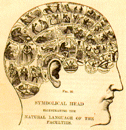

# فصل اول: نقطه آغاز

## آیا ممکن است ما یک زبان خارجی را بهتر از زبان مادری خود استفاده کنیم؟

بله، ممکن است. من هم مانند شما در گذشته باور نداشتم. اما حالا باور دارم، زیرا در این سال‌ها دانش‌آموزان زیادی را تربیت کرده‌ام که چنین کرده‌اند. من شاهد بسیاری از رویدادهای عادی بوده‌ام که در نظر دیگران "معجزه" به نظر می‌رسد.

تمام افرادی که چندزبانه هستند (multilingual)، در نهایت یک "زبان غالب" (Dominant Language) دارند. اینکه کدام یک زبان غالب است، به این بستگی ندارد که کدام یک زبان مادری است، بلکه به این بستگی دارد که کدام یک بیشتر استفاده می‌شود.

من از کودکی دوزبانه بوده‌ام - چون از قومیت کره‌ای هستم. هر دو زبان کره‌ای و چینی برای من زبان مادری هستند، هر دو را از کودکی بلد بوده‌ام و به یک اندازه روان. با این حال، با گذشت زمان، به دلیل استفاده بیشتر از زبان چینی در زندگی روزمره نسبت به زبان کره‌ای، در نهایت زبان غالب برای من چینی شد - فقط به این دلیل که بیشتر از آن استفاده کرده‌ام.

در پنج سال گذشته، من بسیاری از دانش‌آموزان دبیرستانی را تربیت کرده‌ام. آنها از سال اول دبیرستان (بعضی‌ها کمی دیرتر) شروع به آماده‌سازی برای تحصیل در خارج از کشور کرده‌اند. ضمن تضمین موفقیت در دروس مدرسه، آنها باید تلاش اضافی کنند تا نمرات بالای TOEFL و SAT را کسب کنند، تا بتوانند در پاییز سال سوم دبیرستان به دانشگاه‌های معتبر ایالات متحده بروند. اولین دسته از دانش‌آموزان دبیرستانی که من با آنها کار کردم، حالا دوره کارشناسی خود را به پایان رسانده‌اند و اکثر آنها در حال تحصیل برای درجه دکترا در دانشگاه‌های ایوی لیگ هستند...

برای این افراد، از نظر عملی، زبان غالب‌شان ممکن است دیگر زبان مادری‌شان نباشد، بلکه انگلیسی باشد. زیرا در مرحله‌ای از رشد که سریع‌ترین و متمرکزترین و غنی‌ترین دوره کسب اطلاعات بوده‌اند، تقریباً تمام استفاده‌شان از زبان انگلیسی بوده است. در واقع، در سه سال پیش از ترک چین، سطح زبان انگلیسی آنها از تصور دیگران فراتر رفته بود - بسیاری از دانش‌آموزان نمرات بالای 2300 در آزمون SAT کسب کرده بودند: این نمرات، حتی در میان آمریکایی‌ها نیز، جزو نادرترین‌ها است. (توجه داشته باشید که پس از سال 2016، نمره کلی SAT به 1600 تغییر یافته است.)

حتی برخی از آنها (نه لزوما اقلیت) از لحظه ورود به دانشگاه‌های معتبر آمریکا شروع به یادگیری یک زبان خارجی دیگر کردند، مانند فرانسوی، اسپانیایی، آلمانی و غیره؛ و دو یا سه سال بعد، آنها قادر شدند به راحتی از "زبان سوم" خود در شنیدن، گفتن، خواندن و نوشتن استفاده کنند...

وقتی در دانشگاه‌های داخلی سخنرانی می‌کنم، اغلب این دانش‌آموزان را مثال می‌زنم، و بسیاری از دانشجویانی که برای آزمون‌های سطح چهار و شش با مشکل مواجه هستند، با تردید به من نگاه می‌کنند: "آه، کی باور می‌کند؟"، "چطور ممکنه!" من درک می‌کنم. برای آنها، چنین چیزی غیرممکن است - هر چند که این فقط تصور آنهاست.

## آیا ما می‌توانیم یک زبان خارجی را بهتر از زبان مادری خود به کار بگیریم؟

پاسخ این سوال "بله" است. و این پاسخ تک کلمه‌ای بسیار مهم است.

هرچند که نه هر کسی می‌تواند این کار را انجام دهد، اما واقعیت اینکه "ممکن است" یا "می‌تواند" باشد، همه چیز را تغییر می‌دهد، حداقل می‌تواند همه چیز را برای برخی از افراد تغییر دهد. این مانند این است که همیشه تعداد کمی از افراد واقعاً درک می‌کنند که تفاوت بین 1 و 99 هرچند بزرگ باشد، هرگز به اندازه تفاوت بین 0 و 1 نیست.

دانستن این پاسخ تک کلمه‌ای می‌تواند نقطه شروع تازه‌ای برای برخی از افراد باشد.

## پس چرا اکثر مردم نمی‌توانند به خوبی زبان خارجی یاد بگیرند؟

"با اینکه سال‌ها زبان خارجی خوانده‌ام، چرا هر چه بیشتر می‌خوانم، بدتر می‌شوم..."

این سردرگمی من در ابتدا بود. سال‌ها سخنرانی و تدریس در سراسر کشور به من نشان داد که بسیاری از مردم با این احساس همدلی دارند - من تنها نبودم.

چرا ما هر چه بیشتر یاد می‌گیریم، بدتر می‌شویم؟

زیرا ما هرگز باور نداشته‌ایم که می‌توانیم یاد بگیریم و خوب یاد بگیریم!

ترسناک‌تر این است که پس از فهمیدن، متوجه می‌شویم: ممکن است حتی ندانیم که "هرگز باور نداشته‌ایم".

اکثر ما در درون خود هرگز باور نداشته‌ایم که می‌توانیم یک زبان خارجی را خوب یاد بگیریم - چه برسد به چندین زبان. کسانی که در چندین زبان مهارت دارند، در نظر ما افرادی با استعداد خاص هستند، "متفاوت از ما افراد عادی".

هرچند در طی سال‌های گذشته (شش سال دبستان، شش سال دبیرستان، چهار سال دانشگاه...) ما همیشه "تلاش" کرده‌ایم تا انگلیسی یاد بگیریم، اما واقعیت این است که پیشرفت چندانی نداشته‌ایم. وقتی صادقانه با واقعیت روبرو می‌شویم، هر کسی که سال‌ها تلاش کرده تا انگلیسی یاد بگیرد و موفق نشده، اعتراف می‌کند: در این سال‌ها، واقعاً وقت کمی را صرف یادگیری کرده‌ایم.

از یک طرف می‌دانیم که انگلیسی بسیار مفید است و بهتر است یاد بگیریم، اما از طرف دیگر، به دلیل عدم باور درونی به توانایی خود، واقعاً تلاش زیادی نمی‌کنیم. علاوه بر این، این دو دیدگاه کاملاً متضاد باعث اضطراب و ناامیدی یادگیرندگان می‌شود. در نهایت، چه چیزی باعث می‌شود که ما "هرگز باور نداشته باشیم"؟ چه چیزی باعث می‌شود که ما "هرگز باور نداشته باشیم" و همچنین از آن بی‌خبر باشیم؟
شاید دلایل زیادی وجود داشته باشد. اما کتاب‌های درسی انگلیسی ما در مدارس متوسطه قطعاً یکی از عوامل اصلی هستند (حداقل یکی از آنها). در کشور ما، دایره واژگان انگلیسی برای کنکور تقریباً از حدود 3500 کلمه تشکیل شده است. با توجه به تفاوت‌های منطقه‌ای و تفاوت در کتاب‌های درسی، بیایید کمی بیشتر حساب کنیم و آن را 3600 کلمه در نظر بگیریم. هرچند ما از تأثیر این عدد بر خودمان آگاه نیستیم، اما واقعیت انکارناپذیر این است که ما این عدد را می‌دانیم - حداقل به طور تقریبی.

قبل از فارغ‌التحصیلی از دبیرستان، ما حداقل 6 سال انگلیسی خوانده‌ایم - دوران دبستان و پیش‌دبستانی را حساب نمی‌کنیم. پس این به چه معناست؟ این عدد 3600 به ما می‌گوید که اگر هر سال 600 کلمه انگلیسی یاد بگیریم، کافی است -

اگر واقعاً موفق به انجام این کار شویم، نتیجه آزمون انگلیسی کنکور ما قطعاً در بین برترین‌ها خواهد بود... یک سال 365 روز دارد، پس به طور میانگین روزانه چند کلمه باید یاد بگیریم؟ کمتر از 2 کلمه کافی است...

تعداد کلمات انگلیسی در دفترچه واژگان کنکور، به آرامی و بی‌صدا پیامی به هر کودک می‌فرستد:

انگلیسی خیلی سخت است...

تو خیلی ناتوان هستی...

یادگیری دو کلمه در روز کار بزرگی است!

بله، دقیقاً همینطور است.

در بهار 2010، من نخستین نسخه این کتاب را تکمیل کردم. در آن زمان هنوز برایم دشوار بود که این مفهوم را به طور ساده و روشن به خوانندگان منتقل کنم. خوشبختانه، در پاییز همان سال، کریستوفر نولان، کارگردان هالیوودی، فیلمی با نام جهانی "Inception" (ترجمه شده به "سرقت رویا") ساخت. این عنوان فیلم به یک مفهوم شناخته‌شده برای همه تبدیل شد. این به من کمک زیادی کرد! نولان در این فیلم به تماشاگران توضیح می‌دهد که یک ایده باید به اندازه کافی ساده باشد تا بتوان آن را کاشت؛ ساده‌ترین ایده‌ها پس از کاشته شدن، ریشه‌دارتر و محکم‌تر می‌شوند؛ زیرا فردی که این ایده را دارد، نمی‌تواند تشخیص دهد که این ایده از خودش است یا کاشته شده... به همین ترتیب، دفترچه واژگان کنکور به این شیوه، آن ایده بسیار ساده را به آرامی و به طور "کاشته شده" در ذهن ما جای می‌دهد و برای تمام عمر بر ما تأثیر می‌گذارد...

بسیاری اوقات، نادانی انسان‌ها نتیجه تعلیم و تربیت است. آموزش و پرورش همیشه در شکست نقش دارد - بنابراین موفقیت همیشه اتفاقی است. عجیب و غریبی آموزش در این است که، اگر دانش‌آموزان را به عنوان نابغه تربیت کنیم، آنها تقریباً هیچ‌گاه نابغه نخواهند شد، زیرا نبوغ معمولاً از خودآموزی ناشی می‌شود؛ اما، اگر دانش‌آموزان را به عنوان ناتوان تربیت کنیم، قطعاً ناتوان خواهند شد - زیرا نادانی از طریق آموزش به وجود می‌آید.

خوشبختانه، هر کسی حق خودآموزی دارد و در واقع، هر کسی تا حدودی توانایی خودآموزی دارد. بهتر این است که برخی دانش‌ها می‌توانند به سرعت درک شده و اثرگذار باشند. در بخش قبلی، این سوال پاسخ داده شد که "آیا ما می‌توانیم یک زبان خارجی را بهتر از زبان مادری خود به کار بگیریم؟" و پاسخ "بله" بود. اهمیت دانستن این پاسخ در این است که می‌تواند افکار قبلی که در ذهن ما کاشته شده‌اند را ریشه‌کن کند.

## چرا برخی دیگر از مردم به راحتی زبان یاد می‌گیرند؟

در مقابل کسانی که هرچه بیشتر می‌آموزند، بیشتر عقب می‌مانند، برخی افراد وجود دارند که شاید تعدادشان کم باشد اما به آسانی یاد می‌گیرند و خوب می‌آموزند - همانطور که قبلاً اشاره کردم، مثل این "خوش شانس‌ها" که در دانشگاه‌های معتبر ایالات متحده درس می‌خوانند.
مسئله این است که آنها نیز با همان افکار تربیت شده‌اند - آنها نیز در دبیرستان‌های داخلی درس خوانده‌اند، از همان کتاب‌های درسی استفاده کرده‌اند، در همان کلاس‌ها شرکت کرده‌اند، و با همان معلمان انگلیسی مواجه شده‌اند... پس چرا آنها تحت تأثیر قرار نگرفته‌اند؟
پاسخ این است که آنها با یک ایده متفاوت پرورش یافته‌اند، هرچند خودشان شاید از واقعیت اوضاع آگاه نباشند. اکثر این دانش‌آموزان در شهرهای بزرگ چین بزرگ شده‌اند، جایی که حداقل یک موسسه آموزشی برای آماده‌سازی آزمون‌های TOEFL/SAT وجود دارد.

وجود خود این نوع موسسات آموزشی از "کیفیت آموزشی" آنها مهم‌تر است. این موسسات مدام پیامی را منتشر می‌کنند: یک آزمون به نام TOEFL وجود دارد (در این چند سال اخیر، آنها باعث شده‌اند که مردم بیشتری از یک آزمون دیگر به نام SAT آگاه شوند)، بسیاری می‌روند تا در آن شرکت کنند، بسیاری آن را می‌دهند، و در نهایت بسیاری امتیاز بالایی کسب می‌کنند (اینکه آیا مخاطبان این پیام دچار خطای منطقی می‌شوند یا نه مهم نیست، مهم این است که حتی این نوع اشتباه منطقی نیز بخشی مهم از پیام قدرتمندی است که منتقل می‌شود)... مهم‌تر از همه، افرادی که برای آموزش، شرکت در آزمون و در نهایت کسب امتیاز بالا می‌روند، درست در کنار ما هستند؛ و وقتی مردم می‌بینند کسانی که "حتی از خودشان هم بدتر هستند" برای آموزش، شرکت در آزمون و در نهایت کسب امتیاز بالا می‌روند، اقدام به عمل کردن به طور طبیعی انجام می‌شود.

به عبارت دیگر، "وجود این نوع موسسات آموزشی" به خودی خود ممکن است برای دانش‌آموزان معنادارتر و تأثیرگذارتر از "رفتن به یک موسسه آموزشی خاص" باشد. این نظریه‌ای نیست که من خودم ابداع کرده‌ام، در واقع، در خارج از کشور یک دوره تخصصی وجود دارد که "قدرت مکان" نام دارد - یک شاخه از جغرافیا که به طور خاص به مطالعه این مکانیسم و تأثیرات آن می‌پردازد.

این است قدرت تفکر. اگر شما از وجود آزمون TOEFL آگاه نباشید، حتی فرصت شرکت در آن آزمون را نخواهید داشت. اگر شما فکر نکنید که آن یک آزمونی است که می‌توانید در آن امتیاز بالا کسب کنید، شما حتی ممکن است اصلاً تلاشی برای آن نکنید. فقط به این دلیل که شما از وجود آن آگاه شده‌اید، شما ممکن است شروع به تلاش کنید؛ فقط به این دلیل که شما می‌بینید که افرادی که "حتی از شما بدتر هستند" (هرچند این ممکن است صرفاً یک توهم باشد) امتیاز بالایی کسب کرده‌اند، شما دلیلی برای عدم تلاش ندارید، و در نهایت شما نیز ممکن است امتیاز بالایی کسب کنید...

در واقع، "من هم می‌توانم" این سه کلمه برای اکثر مردم عادی محرکی بسیار واقعی و مؤثر است. این موضوع به ویژه در زمینه‌هایی مانند یادگیری زبان دوم که تقریباً نیازی به استعداد فطری ندارد، صدق می‌کند.

## ایده ها چگونه بر من تأثیر می گذارند؟

گاهی قدرت افکار آنقدر زیاد است که تنها تغییر کوچکی در یک اندیشه می‌تواند تمام زندگی یک فرد را دگرگون کند.
نفوذ به عمق ماهیت مسائل به اندازه‌ای که بر زبان آوردنش آسان است، آسان نیست. مورخان پس از سال‌ها تحقیق به این نتیجه رسیدند که آنچه واقعاً باعث شکست بومیان آمریکا شد، نه سلاح‌های پیشرفته اروپاییان، بلکه ویروس‌هایی بود که روی بدن اروپاییان وجود داشت و هیچ کدام از اروپاییان یا بومیان آن زمان نمی‌توانستند آن‌ها را ببینند یا لمس کنند. این ویروس‌ها باعث شدند که بومیان به طور گروهی بیمار شوند و بمیرند و این امر باعث شد اروپاییان "گویی با کمک خدایی" به نظر برسند...
بنابراین، بسیاری اوقات، ریشه واقعی مشکلات با آنچه به ظاهر روشن و واضح است، بسیار دور است. و قدرت افکار نیز بر روی من نیز تأثیراتی دراماتیک داشته است.

حدود بیست سال پیش (حوالی سال 1988) وقتی که من تازه دبیرستان را شروع کرده بودم. در دفتر تحقیقاتی پدرم یک استاد جوان زبان انگلیسی برای اولین بار در آزمون تافل شرکت کرد و نمره 570 از 677 را کسب کرد. همه وقتی در مورد این موضوع صحبت می‌کردند، می‌گفتند: "این نمره خوبی است!" (چرا که قبلاً یک استاد دیگر در همان آزمون نمره 530 کسب کرده بود...) هرچند من نمی‌دانستم آن آزمون چگونه است، اما تصورم این بود که آن یک آزمون بسیار سخت است.

چند سال بعد، در سال 1993، وقتی که من در سال سوم دانشگاه بودم، شنیدم که یکی از دانشجویان کلاس کناری قصد دارد در آزمون تافل شرکت کند. حالا به یاد می‌آورم که در آن زمان دانشجویانی که در پکن تحصیل می‌کردند، با شور و شو
ق برای این آزمون آماده می‌شدند، اما در آن زمان در شهر چانگچون، کسی از وجود چنین آزمونی خبر نداشت. در آنجا، من یکی از دانشجویانی بودم که اطلاعات نسبتاً خوبی داشتم. یک شب که به خوابگاه بازگشتم، وقتی بچه‌ها درباره این موضوع صحبت کردند، من در مورد سختی آزمون تافل توضیح دادم. وقتی آنها شنیدند که یک معلم دانشگاه فقط 570 نمره گرفته، با تعجب زبان‌شان را بیرون آوردند و گفتند: "این آزمون که اصلاً برای انسان نیست!" پس از آن، همه به آن دانشجو لقب "حیوان" دادند.

آن تابستان، من به پکن رفتم تا از یک دوست دبیرستانی که در دانشگاه تسینگهوا تحصیل می‌کرد بخواهم که یک کامپیوتر 486 برایم بسازد. هنگامی که از کنار یک خانه کوچک عبور می‌کردیم، او به آن خانه اشاره کرد و گفت: "آنجا نیو ایسترن است." او با لحنی صحبت کرد که گویی من باید از این موضوع اطلاع داشته باشم. پس من پرسیدم، "نیو ایسترن چیست؟" او به من گفت که آن یک موسسه آموزشی زبان انگلیسی است و اگر کسی می‌خواهد به خارج از کشور برود، باید در آنجا آموزش ببیند. به گفته او، دانشجویان دانشگاه می‌گفتند: "شرکت در آنجا شاید منجر به کسب نمره بالا نشود، اما اگر شرکت نکنی، قطعاً نمره بالا نخواهی گرفت." این موضوع به سرعت تمام شد و ما به بحث دیگری پرداختیم که من اکنون به یاد نمی‌آورم...

سال‌ها بعد، پس از چندین سال تدریس در نیو ایسترن، یک روز به یاد آوردم که سال‌ها پیش، زمانی که یو مین‌هونگ، بنیان‌گذار نیو ایسترن، هنوز در مرحله راه‌اندازی کسب‌وکار خود بود، من در واقع از نیو ایسترن شنیده بودم... اما بحثی که در آن زمان در خوابگاه انجام شد، به سرعت توسط هم‌اتاقی‌هایم فراموش شد. حتی اکنون نام آن دانشجو را به یاد نمی‌آورم. البته نمی‌دانم او در آزمون تافل چه نمره‌ای گرفت، اما می‌دانم که سال بعد به آمریکا رفت.

در سال 2003، روزی که کتاب "شکستن مرزهای واژگانی تافل در 21 روز" منتشر شد، من میزبانی کردم و گروه بزرگی از دوستانم گرد هم آمدند و گپ زدند. ناگهان به یاد آوردم که در سال 1994 (که حدود ده سال پیش بود) وقتی که از کنار محل قدیمی نیودانگ فنگ در حال رد شدن بودم تا کامپیوتر جمع کنم، ناگهان به یاد دانش‌آموزی افتادم که به او لقب "حیوان" داده بودیم، و ناخودآگاه لرزیدم.

پیش از این لرزش، همیشه فکر می‌کردم که در سال 2000 و در سن 28 سالگی، خودم را در یک اتاق کوچک حبس کرده و در مدت چهار ماه نمرات بالای تافل و GRE را به دست آوردم و این کار ارزش تحسین خودم را داشت؛ اما پس از این لرزش، ناگهان متوجه شدم که در واقع من در سال 1993 (که "خیلی احمق و ساده‌لوح" بودم) فرصت داشتم تا تافل و GRE را بدهم، اما آن زمان فکر می‌کردم این کار "غیرممکن" است؛ و خودخواهانه مانند دیگر دانش‌آموزان آن دانش‌آموز را "حیوان" خطاب می‌کردم... اگر آن سال برای آزمون‌های تافل و GRE آماده می‌شدم (نه در سن 28 سالگی - فرق هفت ساله!)، اکنون به نظر می‌رسد که با توجه به هوش و استعدادی که در دوران دانشگاه داشتم، شاید در کمتر از چهار ماه (شاید سه ماه؟) می‌توانستم نمرات بالا را کسب کنم. اگر واقعاً اینطور بود، زندگی‌ام پس از آن چقدر متفاوت می‌شد؟ اکنون به نظر می‌رسد که آن زمان ذهنیت من واقعاً "حیوانی" بوده است، و ناخودآگاه عرق سردی مثل باران شدید بر پیشانی‌ام نشست.

من اغلب این تجربه‌ام را برای دانش‌آموزانم تعریف می‌کنم. انسان‌ها همین‌طور هستند، وقتی بارها و بارها حرف‌های بزرگ شنیده می‌شود، دیگر گوش نمی‌دهند، اما مثال‌های واقعی و قابل لمس آن‌ها را تحت تأثیر قرار می‌دهد. طی این سال‌ها، می‌دانم که این تجربه من برای بسیاری از دانش‌آموزانم اثرگذار بوده و زندگی برخی از آن‌ها و حتی برخی از مواردی که من خودم از آن‌ها بی‌خبرم را تغییر داده است.

## آیا مبنای نظری برای این نتیجه گیری وجود دارد؟

در آزمون GRE یکی از موضوعات مقاله این است:

"هیچ حوزه مطالعاتی نمی‌تواند به طور چشمگیری پیشرفت کند، مگر اینکه افراد بیرونی دانش و تجربه خود را به آن حوزه بیاورند."
مگر اینکه افراد خارجی دانش و تجربه خود از سایر حوزه‌ها را به ارمغان بیاورند، هیچ حوزه‌ای نمی‌تواند به طور قابل توجهی پیشرفت کند.
هرچند این گفته همیشه صادق نیست، اما اغلب اوقات اتفاق می‌افتد. به عنوان مثال، این کتاب در مورد یادگیری زبان دوم (یادگیری انگلیسی) است، اما باید از جای دیگر شروع کرد.

دو محقق از دانشگاه جانز هاپکینز، دیوید هوبل و تورستن ویزل، در اواخر سال 1959 شروع به انجام آزمایشی کردند که در سال‌های بعد تأثیرات بسیاری بر روی شمار زیادی از یادگیرندگان زبان دوم در سراسر جهان گذاشت - اگرچه این تأثیرات عمدتاً منفی بودند - با وجود اینکه آزمایش خود به طور مستقیم با یادگیری زبان خارجی ارتباطی نداشت: مطالعه روی توسعه اولیه سیستم بینایی حیوانات.
آنها یکی از چشم‌های گربه‌ها یا میمون‌های تازه متولد شده را به وسیله جراحی بستند؛ پس از مدتی دوباره چشم بسته شده را باز کردند. تحقیقات نشان داد، حتی پس از باز شدن دوباره پلک‌های دوخته شده،

چشم‌های این حیوانات دیگر قادر به بازیابی توانایی بینایی خود نبودند. بستن چشم یکی از حیوانات در طی این دوره زمانی تأثیر قابل توجهی بر ساختار منطقه بینایی در مغز آنها داشت. اما انجام همین کار بر روی گربه‌های بالغ برای مدت زمان مشابه یا حتی طولانی‌تر نه تنها بر توانایی بینایی آنها تأثیری نداشت، بلکه بر ساختار مغز آنها نیز تأثیری نگذاشت. تنها حیوانات جوان در "دوره کلیدی" (Critical Period) رشد خود تحت تأثیر این محرومیت بینایی قرار می‌گیرند.

این تحقیق و نتایج آن در نهایت منجر به دریافت جایزه نوبل پزشکی در سال 1981 برای این دو نفر شد، "زیرا این تحقیق کمک بزرگی به درک نحوه پردازش اطلاعات توسط سیستم بینایی داشته است". اما به نظر می‌رسد که مردم به مفهوم "دوره کلیدی" که در این تحقیق مطرح شده، بیشتر علاقه‌مند هستند. دانشمندان به سرعت دریافتند که دیگر بخش‌های مغز نیز برای توسعه به تحریک نیاز دارند و به نظر می‌رسد که همه آن‌ها با نظریه دوره کلیدی مطابقت دارند. بر اساس نظریه دوره کلیدی، فقط در طی دوره کلیدی است که مغز "قابل انعطاف" (Plastic) است و در این زمان، تحریکات خارجی حتی می‌توانند ساختار مغز را تغییر دهند؛ اما پس از پایان دوره کلیدی، مغز دیگر انعطاف‌پذیر نیست. به سرعت، مفهوم "دوره کلیدی" به حوزه‌های مختلف علمی گسترش یافت.

زبان‌شناس اریک هاینز لنبرگ، که در آلمان متولد شد، در زمان جنگ جهانی دوم به برزیل فرار کرد و سپس به آمریکا مهاجرت نمود، در دانشگاه شیکاگو و دانشگاه هاروارد تحصیل کرد. او بعداً به عنوان استاد روان‌شناسی و علوم اعصاب، در دانشکده پزشکی دانشگاه هاروارد، دانشگاه میشیگان آن آربر و دانشکده پزشکی دانشگاه کورنل فعالیت داشت. پروفسور لنبرگ در سال 1967 فرضیه "دوره کلیدی یادگیری زبان" (Language acquisition Critical period hypothesis) را مطرح کرد و بر این باور بود که دوره کلیدی یادگیری زبان از زمان تولد نوزاد آغاز شده و در یک زمانی بین هشت سالگی تا پایان دوران نوجوانی خاتمه می‌یابد. پس از "دوره کلیدی"، توانایی یادگیری زبان دوم به طور قابل توجهی کاهش می‌یابد و دیگر امکان رهایی از تأثیر لهجه زبان مادری وجود ندارد.

در واقع، پروفسور لنبرگ بسیار محتاط بود و تنها یک "فرضیه" (Hypothesis) را ارائه داد. اما تقریباً تمام نتایج تحقیقات علمی هنگام ورود به حوزه ارتباطات عمومی، به نوعی با سوء تفاهم مواجه می‌شوند و حتی گاهی عمداً تحریف می‌شوند. به عنوان مثال، پس از ارائه "خوشبینی آموخته شده" توسط پروفسور مارتین سلیگمن از دانشگاه پنسیلوانیا، فوراً توسط استادان موفقیت به عنوان ابزاری در دستان خود استفاده شد، بدون توجه به نگرش احتیاطی و دقت سلیگمن. به همین ترتیب، "فرضیه" پروفسور لنبرگ در بازار به "نظریه" (Theory) تبدیل شد. "شروع از تولد نوزاد و پایان در یک زمانی بین هشت سالگی تا پایان دوران نوجوانی" نیز به "شروع از 0 سالگی و پایان در 10 سالگی" تغییر یافت - در چین، که در سوی دیگر اقیانوس قرار دارد، این تبدیل به ابزار اصلی تبلیغاتی تمامی برنامه‌های آموزش زبان انگلیسی کودکان شد، با هدف ترساندن والدین برای پرداخت هزینه "در غیر این صورت دیگر فرصتی نخواهید داشت!". بیشتر از همه، این "نظریه دوره کلیدی" به بهانه‌ای برای تسلی دادن خود بسیاری تبدیل شد. "یادگیری سخت است، چرا که دوره کلیدی به پایان رسیده!" یا "اگر از کودکی یاد نگرفته باشیم، دیگر ممکن نیست..." و یا "در این سن و سال، دیگر امکان‌پذیر نیست!" و غیره.

در حقیقت، کمک واقعی دیوید هوبل و تورستن ویزل در اثبات این بود که مغز "قابل انعطاف" است و ثابت و بدون تغییر نیست. محدودیت اصلی آن‌ها دقیقاً در مفهوم "دوره کلیدی" بود که مورد علاقه عموم قرار گرفته است. در آن زمان، آنها هنوز طرفداران محکم "نظریه منطقه‌ای" بودند - نظریه‌ای که بسیار بعدتر توسط جامعه دانشگاهی رد شد.

نظریه محلی‌سازی (Localizationism) بیان می‌کند که مغز مانند یک ماشین پیچیده عمل می‌کند، که هر بخش آن دارای کارکرد خاص خود است؛ در نتیجه، هر کارکرد خاصی تحت محدودیت‌های سخت‌افزاری (Hardwired) قرار دارد. این بدان معناست که اگر بخشی از مغز آسیب ببیند، عملکرد مربوط به آن ناحیه قادر به بازیابی نخواهد بود. مشاهدات بالینی نیز به نظر می‌رسد این نتیجه‌گیری را تایید می‌کنند: به عنوان مثال، اندام‌های فلج شده بیماران سکته مغزی به نظر می‌رسد که هرگز قابل بازیابی نیستند.

یک پسر بسیار زیبا، نیست؟ متوجه شدید، چشمان او؟ این تأثیرات ویژه نیست، چشمان این پسر واقعاً درخشان هستند. این پسر از قوم دریایی ژیپسی‌ها (Sea Gypsies) است که چشمانشان همگی درخشان هستند.

قوم دریایی ژیپسی‌ها نزدیک سواحل غربی تایلند زندگی می‌کنند و از اقوام کوچ‌نشین هستند، با این تفاوت که آن‌ها با صید آبزیان زندگی می‌کنند. بیشتر عمرشان را در دریا می‌گذرانند. این پسر نیز در دریا به دنیا آمده است. آن‌ها قبل از یادگیری صحبت کردن و راه رفتن، شنا کردن را یاد می‌گیرند. آن‌ها می‌توانند بدون استفاده از هیچ وسیله‌ای به راحتی تا عمق 30 فوت زیر آب فرو روند - قبیله‌ای به نام سولو وجود دارد که اغلب برای جمع‌آوری مروارید تا عمق 75 فوت زیر آب می‌روند. آن‌ها می‌توانند نرخ ضربان قلب خود را کنترل و کاهش دهند و در نتیجه مصرف اکسیژن خود را کنترل کنند، بنابراین می‌توانند مدت زمان طولانی‌تری نسبت به افراد عادی در زیر آب بمانند، اغلب دو برابر یا بیشتر.

البته، مورد شگفت‌انگیزترین آن‌ها چشمانشان است. آن‌ها می‌توانند در زیر آب دید خوبی داشته باشند، حتی بهتر از حالت عادی. زیرا آن‌ها یاد گرفته‌اند چگونه اندازه مردمک چشم‌شان را کنترل کنند و می‌توانند مردمک‌های خود را تا 22٪ کوچک کنند. در حالی که تاکنون تصور می‌شد که
میزان انقباض مردمک‌ها ثابت است (توسط ژن‌های انسان تعیین شده) و نباید تحت کنترل آگاهانه باشد، بلکه تحت کنترل "سیستم عصبی خودمختار" قرار دارد.

دانشمندان بر این باورند که این نتیجه "جهش ژنتیکی" نیست، بلکه نتیجه "انعطاف‌پذیری" (Plasticity) مغز است. زیرا دانشمندی به نام آنا گیسلن و همکارانش قوم دریایی ژیپسی‌ها را به اروپا آوردند و به سرعت توانستند به گروهی از کودکان سوئدی یاد دهند که چگونه مردمک‌های خود را منقبض کنند. اکنون دانشمندان بر این باورند که انعطاف‌پذیری مغز بسیار قوی است و همیشه وجود داشته است. هر تحریک خارجی (به‌خصوص آموزش سیستماتیک) می‌تواند تأثیری بر مغز ما داشته باشد و ساختار و عملکرد آن را تغییر دهد.

باستانیان می‌گویند، "اگر از قبیله ما نباشند، قلب‌شان متفاوت است". از این منظر درست است، زیرا به نظر می‌رسد فرهنگ به طور مداوم در حال شکل دادن به مغز افرادی است که تحت تأثیر این فرهنگ قرار می‌گیرند. مشکلاتی که پیش از این به عنوان محدودیت‌های "سخت‌افزاری" در نظر گرفته می‌شدند، اکنون به وضوح (دست‌کم بخشی از آن‌ها) به عنوان مسائل مربوط به توسعه "نرم‌افزاری" اثبات شده‌اند. مغز ما مانند یک کامپیوتر جادویی است - زیرا حتی سخت‌افزار آن نیز توانایی "سازگاری" با "نرم‌افزار" نصب شده را دارد.

دلیلی که دانشمندان نتیجه‌گیری کرده‌اند که "توانایی‌های خاص" قوم دریایی ژیپسی‌ها نتیجه "جهش ژنتیکی" نیست، بر اساس دو عامل است:
تحقیقات نشان می‌دهد که ساختار مغز انسان در طول ده‌ها هزار سال گذشته تقریباً بدون تغییر باقی مانده است؛ این توانایی می‌تواند در یک نسل یاد گرفته شود و نیازی به انتقال ژنتیکی ندارد.

در صد سال اخیر، نقاشی‌های غاری (Cave Painting) فراوانی در سراسر جهان کشف شده‌اند. بر اساس تحلیل ایزوتوپ‌های کربن، قدیمی‌ترین این نقاشی‌ها به سی هزار سال پیش و جدیدترین‌ها به حدود ده هزار سال پیش برمی‌گردند. این آثار اغلب نقاشان مدرن را شگفت‌زده و حتی مایوس می‌کنند. پابلو پیکاسو در سال 1940 پس از بازدید از غارهای لاسکو (Lascaux) در شهر دوردونی فرانسه که به تازگی کشف شده بودند و دیدن این نقاشی‌های غاری (تصویر بالا یکی از این آثار است)، اندکی ناامید شد و در مورد هنر مدرن اظهار داشت: «ما در واقع چیزی یاد نگرفته‌ایم.»

اما در واقع، این خبر بدی نیست. بلکه دقیقاً خبر خوبی است. توانایی افراد چندین هزار سال پیش برای خلق چنین آثار شگفت‌انگیزی، نشان‌دهنده پتانسیل کافی مغز انسان در آن زمان است و پیشرفت و توسعه ما امروزه، در واقع نتیجه بهره‌برداری از این پتانسیل است.
آنا گیسلن ثابت کرد که این توانایی‌ها از طریق ژنتیک به دست نیامده‌اند، چرا که او توانست به گروهی از کودکان اروپایی در عرض هشت ماه یاد دهد تا مانند قوم دریایی ژیپسی‌ها مردمک‌های خود را منقبض کنند، که این نشان می‌دهد اهمیت واقعی این کشف برای کسانی که زبان دوم را یاد می‌گیرند بسیار بزرگ است. همیشه در میان جامعه علمی بحث وجود داشته است که "آیا توانایی زبانی ذاتی است یا خیر؟"

در واقع، نیازی به بحث نیست. به وضوح توانایی زبانی ذاتی نیست، بلکه یک مهارت اکتسابی است. در واقع، زبان و نوشتار تا به حال تنها چند هزار سال سابقه دارند و مغز انسان پیش از آن نه اینکه توانایی پردازش زبان و نوشتار را نداشته، بلکه زبان و نوشتاری برای پردازش وجود نداشته است. دانشمندان پیش‌تر کشف کرده‌اند که آن‌ها می‌توانند در یک نسل به افراد قبایل بومی "زبان و نوشتار جدید" را آموزش دهند. و در واقع، کار آموزش سواد در کشور ما نیز بر همین اساس است. توانایی برتر زبانی انسان نسبت به سایر حیوانات به دلیل حجم بزرگ‌تر مغز و پتانسیل گسترده‌تر آن است. بسیاری از دانشمندان موفق به آموزش برخی از زبان‌های انسانی به میمون‌ها یا سایر حیوانات شده‌اند - فقط مشکل این است که حافظه آن‌ها ضعیف است و پتانسیل محدودی دارند، بنابراین احتمالاً هرگز به سطح انسان نخواهند رسید.

اگر بگوییم که 1) مغز قابلیت انعطاف دارد؛ 2) توانایی زبانی به دست آورده می‌شود، پس به طور نظری هر کسی می‌تواند هر زبانی را یاد بگیرد. اما واقعیت به نظر چنین نیست. و نظریه "دوره حساس" امید را تحت تأثیر قرار می‌دهد. زیرا بر اساس این نظریه، مغز تنها در ابتدایی‌ترین دوره‌های زندگی قابلیت انعطاف دارد. با این حال، بعد از بیست یا سی سال، سرانجام دانشمندان ثابت کردند:

مغز قابلیت انعطاف دارد؛ و این قابلیت را از ابتدا تا انتها حفظ می‌کند؛ حتی می‌تواند خود را بازسازی کند (Reorganizing)، و از طریق آموزش مناسب، می‌تواند توانایی‌های ناحیه‌ای که از بین رفته را با استفاده از ناحیه دیگری یاد بگیرد... فقط مشکل این است که فرایند اثبات این موضوع بسیار دشوار بود. لطفاً حدس بزنید که در تصویر زیر، دست چپ یا راست این دختربچه‌ای که در مرکز توانبخشی UAB در ایالات متحده درمان می‌شود، آسیب دیده است؟

در واقعیت، بازوی چپ او آسیب ندیده بود، اما دلیلی که آن را بسته کردند این بود که این بازو بی‌آسیب بود و بازوی راست او آسیب دیده بود و نیاز به تمرین برای بهبود داشت... همچنین؟ این چگونه ممکن است؟ اما از نظر فیزیولوژیکی، قسمت‌های متضرر از مغز نمی‌توانند بهبود یابند. پس چگونه می‌تواند با تمرین بازوی راستی که قبلاً آسیب دیده است، را به حالت عادی باز گرداند؟

جادوی مغز در اینجاست که می‌تواند از قسمت‌های دیگری که آسیب ندیده‌اند، به‌طور مجدد توانمندی‌های قسمت‌های آسیب‌دیده را مجدداً یاد بگیرد (این در زمینه علمی به نام "بازپهره"، "مسیرمجدد" یا "بازسیم‌کشی" شناخته می‌شود). دلیلی که بازوی چپ که به آسانی حرکت می‌کند بسته شده است، این است که اگر این کار انجام نشود، بخش مغزی که مسئول کنترل بازوی چپ است (یا همان "نقشه مغز بازوی چپ" نامیده می‌شود) به طور "اولویتی فعال" خواهد شد؛ زیرا این بخش بی‌آسیب است و بخش اصلی که کنترل بازوی راست را داشته‌است، آسیب دیده است. به عبارت دیگر، در این لحظه، بخشی از مغز که می‌تواند بازوی راست را کنترل کند وجود ندارد. با بستن بازوی چپ، با این حال، علی‌رغم اینکه بخش مغزی که مسئول کنترل بازوی چپ است همچنان به طور "اولویتی فعال" خواهد شد، اما در واقعیت نمی‌تواند بازوی چپ را به طور آزاد کنترل کند. در این شرایط، می‌توان با انتقال تدریجی بخش‌های دیگر مغز به کنترل بازوی راست، روشی برای کسب توانایی کنترل بازوی راست ایجاد کرد - به عبارت دیگر، می‌توان با تمرین به تدریج یک ناحیه دیگر از مغز (که بی‌آسیب است) را "یادگیری" کرد تا توانایی کنترلی را که در واقعیت تنها در ناحیه آسیب‌دیده وجود داشت، بیاموزد. به زودی بازوی راست دختر به حالت عادی بازگشت و همان‌طور که قبل از این بود، قابلیت حرکت داشت. اما مغز او دیگر همانند گذشته نبود، علی‌رغم اینکه بخشی از آن آسیب دیده و قابل بازیابی نبود، اما ناحیه دیگری از مغز او توسعه یافت و قادر به انجام وظایفی که قبلاً فقط ناحیه آسیب‌دیده مغز انجام می‌داد، به طور کامل بود.

تا سال 2004 فقط، این نوع درمان کاملاً غیر ممکن به نظر می‌آمد. این درمان ابتدا به نظر عجیب و غریب می‌آمد و به نام "درمان حرکت محدود کننده" (مخفف: CI یا CIMT) توسط دکتر ادوارد تاب استاد اختراع شد. امروزه، این درمان به تدریج در سراسر جهان گسترش یافته و به بسیاری از بیماران فلج اطمینان به بازگشت به زندگی اولیه خود کمک کرده است. اما تجربه تحقیقات دکتر تاب مشکلات زیادی داشت. برای یافتن یک راه حل درمانی برای فلج، او مجبور شد میمون‌ها را به صورت عمدی فلج کند (یعنی یک قسمت خاص از مغز میمون‌ها را تخریب کند) و سپس با تمرینات سعی کند که این میمون‌ها را از وضعیت فلج بهبود ببخشد... در اوایل دهه 80 میلادی، او به دلیل اتهامات حقوق حیوانات به دادگاه احضار شد که به تعطیل شدن آزمایشگاه، منابع مالی‌اش و در نهایت حتی از دست دادن شغفه‌اش منجر شد. تقریباً همه افراد از او دوری می‌کردند. در شش سال بعد از این واقعه، تمام انرژی و زمان دکتر تاب صرف دفاع از خودش شد - فشار اجتماعی بزرگ باعث شد که حتی وکیلی برای دفاع از او پیدا نشود، بنابراین او مجبور شد خودش به عنوان وکیل خود عمل کند. پیش از این اتفاق، دکتر تاب تقریباً 100،000 دلار پس انداز داشت، اما تا زمانی که به موفقیت در دادگاه دست پیدا کرد و تمام اتهامات علیه او برطرف شد، فقط حدود 4،000 دلار پس‌انداز باقی ماند. البته، در حال حاضر به عنوان یکی از برجسته‌ترین دانشمندان جهان به شمار می‌آید، به عنوان یکی از ارزشمندترین افراد در ایجاد ارزش‌های عظیم برای انسان‌ها از تئوری و عمل‌اش شناخته می‌شود.

موفقیت درمان CI دکتر تاب در ابتدا نشان داد که نظریه مناطق مغزی نادرست است (حداقل به طور کامل درست نیست) - مغز می‌تواند خودش را مجدداً سازماندهی کند؛ سپس نشان داد که مغز از ابتدا تا انتها قابل تغییر و بازسازی است - به عبارت دیگر، می‌توان با استفاده از نقشه مغزی جدیدی که توسط نقشه‌های مغزی مختوار شده جایگزین کرد؛ در نهایت، اهمیت بزرگی دارد که نشان داده شد: نقشه‌های مغزی با یکدیگر رقابت دارند - بنابراین، برای درمان بازگشت فلجی به دست راست، ابتدا باید بازگشت فلجی دست چپ را محدود کنیم. اگر دست چپ غیرمختوار نشود، نقشه مغزی دست چپ همیشه در برتری خواهد بود و به عبارت دیگر، مغز به وضعیت "یادگیری عدم استفاده" از دست رفته را در مورد دست راست فلجی نشان می‌دهد.

این آخرین نقطه می‌تواند پدیده‌ای که در ابتدا به اشتباه با تئوری "دوران کلیدی" توضیح داده شد، روشن کند: چرا یادگیری زبان دوم بعد از بزرگ شدن دشوار‌تر به نظر می‌آید؟

در بزرگتر شدن، دشواری یادگیری زبان دوم نه در این مسأله است که مغز دیگرانگونه تغییر نمی‌کند، بلکه واقعیت این است که مغز باید با نقشه‌ای که برای زبان دوم استفاده می‌شود، در مقابل نقشه‌ی قدرتمند زبان مادری که قبلاً شکل گرفته است، رقابت کند. البته این رقابت هر چه بیشتر می‌شود، دشوار‌تر می‌گردد. با این حال، این شناخت به مردم امید می‌دهد. در حال حاضر، تعداد زیادی از اساتید آموزش، به آموزش "غوطه‌ور" پشتیبانی می‌کنند و این رویه تأثیر مثبتی دارد. آموزش "غوطه‌ور" به معنای اجبار دانش‌آموزان به استفاده تنها از زبان دوم در زمان و محیط معین و جلوگیری از استفاده از زبان مادری است، تا مغز به سرعت نقشه‌های جدیدی بسازد. نرم‌افزار آموزش زبان "رزتا استون" که در سراسر جهان شناخته شده است، بر اساس این اصل توسعه یافته است.

برای کسانی که به دنبال یادگیری زبان دوم هستند، خبر خوب و آشکارترین و معنی‌دارترین این است:

هر زمانی که بخواهید شروع کنید، خیلی دیر نیست؛ تنها با روش مناسب و صبر کافی، قطعاً می‌توانید یاد بگیرید. حتی ممکن است زبان دوم به اندازه‌ی زبان مادری شما تبدیل به زبان اصلی شما شود. (البته، در ادامه متوجه خواهید شد که یک روش بهتر از "یادگیری" وجود دارد...) در امر یادگیری، اعتقاد به اینکه می‌توانید یاد بگیرید، به تنهایی تضمین موفقیت نیست؛ اما به عبارت دیگر، اعتقاد به اینکه نمی‌توانید یاد بگیرید، در نهایت به معنی امکان نداشتن یادگیری است. این به نام "پیش‌بینی خودپردازی" است، که همیشه به شکل منفی تأثیر می‌گذارد. در واقع، تئوری "دوران کلیدی یادگیری زبان" در سراسر جهان در مدت چهل سال و بیشتر، عواقب ناشمارده‌ای به وجود آورده است، و بسیاری از افراد به طور ناخودآگاه این "فرضیه" را به عنوان "قطعی" پذیرفته و به باور آورده‌اند که نمی‌توانند یاد بگیرند و در نتیجه به قرار "پیش‌بینی خودپردازی" محکوم شده‌اند.

"من استعداد ندارم."، "من نمی‌توانم به خوبی یاد بگیرم."، "زبان انگلیسی خیلی دشوار است." و موارد مشابه، در واقعیت، همه نوع سِحر و جادویی قوی دارند. آنها دارای قدرتی هم قوی و هم شیطانی هستند. اگر به اطراف خود نگاهی بیندازید، شگفت‌زده خواهید شد که بسیاری از افرادی که سال‌ها به یادگیری زبان انگلیسی اختصاص داده‌اند، بهترین جمله انگلیسیی که می‌توانند بگویند این است: "ببخشید، زبان انگلیسی من ضعیف است..." اگر حتی پیشوند هم داشته باشد، یا "ببخشید..." یا حتی "ببخشید، من عذر می‌خواهم..." خواهد بود... از این نمونه‌ها می‌توان به قدرت و گستردگی این "سِحر" پی‌برد.

پروفسور رابرت مورتون این پدیده را کشف کرده و به آن نام "پیش‌بینی خود" یا "پیش‌بینی خود تحقق‌یافته" (Self-fulfilling prophecy) داده است.
وقتی مردم به این باور می‌افتند که یک موضوعی اتفاق خواهد افتاد (به واقعیت، اتفاق افتادن آن مسلماً تضمین نشده است)، در نهایت آن موضوع واقعاً اتفاق می‌افتد.

این نوع داستان‌ها در اسطوره‌های غربی نیز وجود دارند:

پادشاه دیبیس، لائیوس و ملکه یوکاستا پس از تولد پسرشان ادیپوس، پیشگویی می‌شوند که این کودک در آخرالزمان پدر خود را بکشد و مادرش را بگیرد. به منظور جلوگیری از این سرنوشت نحس، لائیوس پاشنه‌ی کودک را سوراخ کرده (ادیپوس در زبان یونانی به معنی "پا آسیب‌دیده" است) و کودک را در بیابان رها می‌کند.

اما چون یک چاره‌ساز این کودک را پیدا می‌کند، او را به سلطنتی به نام پلیبوس می‌فرستد. پلیبوس از ادیپوس خیلی خوش‌استقبال می‌کند و او را به عنوان پسرش بزرگ می‌کند. ادیپوس بزرگ شده و پس از شنیدن پیش‌گویی از معبد، متوجه می‌شود که در آخرالزمان پدرش را خواهد کشت و مادرش را خواهد گرفت. او هنوز نمی‌داند که پلیبوس و ملکه واقعی والدین خود نیستند. برای جلوگیری از تحقق پیش‌گویی، او از کورینت فرار می‌کند و قسم می‌خورد که هیچوقت برنگردد.

بعداً، ادیپوس در یکی از تقاطع‌ها با یک گروه غریبه درگیر می‌شود و اشتباهاً یکی از آن‌ها را می‌کشد، که به عجیب ترین اتفاق از پدر واقعی او، لائیوس، نیز جزء آن گروه بود. بعداً او با حل رمز معمای اسفنکس شیرانسانی که گذاشته بود وارث تاج و تخت دیبیس می‌شود و بر آن می‌آید که زنی که همسر لائیوس بود را به همسر بگیرد.

بعد از صعود ادیپوس به تخت و تاج، دیبیس با مشکلاتی مانند واگیرداری و بلاهای دیگر روبرو می‌شود. ادیپوس به خدایان توسل می‌کند و پس از اظهارنظر پیش‌بین تیریسیاس، نهایتاً متوجه می‌شود که او پسر لائیوس و سرنوشت نحس او تحقق پیدا کرده است. یوکاستا، مادر ادیپوس، از شرم و عذرخواهی خود اینکاره می‌کند و خودکشی می‌کند، و ادیپوس نیز از ناراحتی چشم‌های خود را کور می‌کند.

دکتر مورتون از مکانیسم عمل پیش‌بینی خوداثبات به وسیله مثالی از تحریک کردن بانک استفاده می‌کند:

یک بانک در ابتدا به خوبی عمل می‌کند، اما به ناگهانی شایعاتی می‌گویند که این بانک قرار است ورشکست شود. شایعات به گوش عموم مردم می‌رسد و هر چه می‌گذرد، تعدادی بیشتر از مردم شروع به اعتقاد به آن می‌کنند. برخی از افراد به بانک مراجعه کرده و پس‌اندازهای خود را برداشت می‌کنند. به تدریج، وحشت انتشار پیدا می‌کند و واقعیت می‌شود، به اندازه‌ای که بیشتر افراد به بانک می‌آیند و پس‌اندازهای خود را برداشت می‌کنند... در نهایت، جلبه‌گیری رخ می‌دهد و بانک واقعاً ورشکست می‌شود.

مکانیسم عمل پیش‌بینی خوداثبات تا حدی گیج‌کننده است: کارهای خوب به ندرت به نتیجه می‌انجامند، اما کارهای بد اغلب به طرز معجزه‌آسا ایجاد می‌شوند. اما این می‌تواند توضیح داده شود: این ممکن است به علت رفتار عاطفی "ترس" در مغز انسانی باشد. به عبارت دیگر، شادی ممکن است فردی را متوقف کند تا از آن لذت ببرد، اما ترس دقیقاً معکوس عمل می‌کند و باعث می‌شود فرد فوراً اقدام به جلوگیری از خطر کند، حتی اگر گاهی اوقات مغایر با آرزوهایش باشد. در واقعیت، تصمیم‌گیری‌های برگرفته از ترس تقریباً همیشه با آرزوها منافات دارد.

یک بار این چنین نفرتی فعال شود، به سختی می‌توان آن را متوقف کرد، و این دقیقاً اسمی که به آن می‌دهند از شوما هست. ما خوش‌شانس هستیم که در دورانی زندگی می‌کنیم که اثبات شده است این نفرت وجود ندارد - از تلاش‌های بی‌پایان علمایی چون ادوارد توب سپاس‌گزاری می‌کنیم. ما در نهایت می‌دانیم که این نفرت وجود ندارد، و ترس‌های پیشین بی‌فایده بوده‌اند. همچنین از دانشجویانم در این چند سال سپاس‌گزارم، آنها به من و بسیاری از دانشجویان بعدی و خوانندگان من اجازه دادند که از دوران "تاریکی" خارج شویم و به طلوع خورشید نگاه کنیم.

## دیگر نه "یادگیری" زبان انگلیسی، بلکه باید از زبان انگلیسی "استفاده" کنید!

زبان یکی از ابزارهای گرانبهای انسان است. با این حال، در برخی مواقع، زبان ممکن است تأثیرات جانبی منفی داشته باشد و محدودیت‌هایی برای کسانی که از آن استفاده می‌کنند به وجود آورد. به نوعی، می‌توان گفت که واژه "یادگیری" احتمالاً یکی از بزرگ‌ترین موانع مسیر یادگیری زبان برای بسیاری از افراد است. زیرا افراد اغلب از این واژه ترس زیادی دارند، حتی ترس‌هایی که اغلب غیر ضروری هستند.

این ترس اغلب در افراد بومی از آنجا مشهود است که آن‌ها همیشه فرض می‌کنند هر چیزی را باید ابتدا بیاموزند و سپس استفاده کنند. در بسیاری از موارد، این فرض واقعاً درست است. برای مثال، اگر شما می‌خواهید به عنوان یک پزشک فعالیت کنید، باید پس از گذراندن آزمون‌ها مجوز تمرکز در پزشکی را بدست آورید تا بتوانید به انجام عملیات‌های پزشکی بپردازید؛ یا اگر می‌خواهید وکیل شوید، باید پس از گذراندن آزمون‌های مربوطه مجوز وکالت دریافت کنید تا بتوانید به دفاع از عدالت بپردازید. حتی مهارت‌های ساده‌تری نیز ممکن است اینگونه باشند؛ برای مثال، اگر یک خودرویی را خریداری کرده و می‌خواهید از آن به عنوان وسیله‌ی حمل و نقل استفاده کنید، باید پس از گذراندن آزمون‌های رانندگی مجوز رانندگی بگیرید؛ در غیر اینصورت رانندگی بدون مجوز قانونی نیست.

اما، این فرض برای یادگیری و استفاده از زبان انگلیسی (یا به عبارتی، زبان دوم و حتی زبان سوم دیگر) مناسب نمی‌باشد. دلیل اساسی اینکه رانندگی‌کردن، پزشکی کردن یا وکالت کردن نیاز به گذراندن آزمون دارند، این است که خطاها در اجرای این مهارت‌ها ممکن است به دیگران آسیب بزند - حتی ممکن است غیرقابل جبران باشد. با این حال، در بسیاری از موارد، استفاده از زبان انگلیسی به طور عمده نمی‌تواند به دیگران آسیب برساند. حتی اگر تلفظ انگلیسی شما نادرست باشد، کسی به خاطر آن نمی‌میرد؛ حتی اگر گرامر انگلیسی شما اشتباهات داشته باشد، کسی به دلیل آن درد نخواهد کشید؛ اگر کسی به شما انگلیسی صحبت کند و شما نفهمید یا متن انگلیسی را نخواندید، مگر در موارد استثنایی، احتمالاً دیگر از روی شرم برایتان نخواهند گذشت.

واقعیت این است که هر نوع دانشی باید به وسیلهٔ عملی تجربه شود تا واقعاً یاد گرفته شود. حتی پزشکان نیز باید قبل از اینکه بتوانند به عنوان پزشک فعالیت کنند، سال‌ها عملکرد عملی داشته باشند، اگرچه تحت نظر سخت انتظامی انجام می‌شود. برای دریافت گواهی رانندگی، باید فرصتی برای رانندگی داشته باشید تا بتوانید بیاموزید، اما به طور عمومی پیش از دریافت گواهی رانندگی، تنها در مدرسه رانندگی می‌توانید رانندگی کنید...
نتیجهٔ تنها "یادگیری" و عدم "استفاده" (که واقعیتی برای بیشتر دانش‌آموزان چینی است) این است که بعد از ده‌ها سال هنوز هم در حال یادگیری بدون استفاده هستید (که واقعیت بسیاری از دانش‌آموزان چینی است).

اگر استفاده از انگلیسی به هیچ عنوان به کسی آسیب نمی‌رساند و اگر یادگیری بدون استفاده نمی‌تواند موفقیت آور باشد، بهتر است از ابتدا به صورت مستقیم استفاده کنید.

همچنین می‌توانید اینطور فهمید: تنها با استفاده مداوم می‌توان واقعاً یاد گرفت، چرا که تمامی مهارت‌ها باید از طریق تجربهٔ تست و خطا (تجربه و اشتباه) یاد گرفته شوند. بسیاری از افراد ترجیح می‌دهند "یادگیری تمام عمر" را دنبال کنند، اما به دلیل ترس از اشتباه کردن از "استفاده تمام عمر" منصرف می‌شوند. با این حال، باید بدانید که اشتباه کردن طبیعی است و حتی برای پیشرفت جامع و واقعی لازم است. بنابراین، باید بدانید که اشتباه کردن عادی است، بلکه ضروری است. در هنگام انجام کار، اشتباه کردن حتی لازمه است. اگر در حال انجام کار هستید و هیچ اشتباهی نمی‌کنید، آنچه انجام می‌دهید کار نیست، بلکه رویاپردازی است.

تغییر "یادگیری" به "استفاده" بسیار مهم است، اگرچه به نظر نمی‌آید چیز بزرگی باشد. کلمه "استفاده" در عنوان کتاب "همه می‌توانند از انگلیسی استفاده کنند" هم همین معنی را دارد. و در عنوان فصل‌های قبلی ما، سوال ما این بود: "آیا ما می‌توانیم از زبان خارجی بهتر از زبان مادری خود استفاده کنیم؟" نه "آیا می‌توانیم زبان خارجی را بهتر از زبان مادری خود یاد بگیریم؟" و همین موضوع را در نظر بگیرید.
در مورد چگونگی و کجا استفاده کردن، در فصل‌های بعدی از چند دیدگاه مختلف مورد بررسی قرار می‌دهیم. اما اصول بسیار ساده‌ای دارد: همانطور که از زبان مادری خود استفاده می‌کنید، باید از انگلیسی استفاده کنید. به "استفاده از زبان خارجی" به سادگی نگاه نکنید - بنیاناً این یعنی حرف زدن و خواندن. این کار مطمئناً آسان نیست، اما مطمئناً به اندازه ای دشوار نیست.

## آیا انگلیسی واقعاً مفید است؟

به نظر می‌آید که هر کسی می‌داند انگلیسی بسیار مفید است و باید آن را یاد بگیرد و به خوبی یاد بگیرد. اما آیا واقعاً اعتقاد دارید؟ در واقعیت، بیشتر مردم به چیز دیگری اعتقاد دارند.

من با تعداد زیادی از دانش‌آموزان ارتباط برقرار کرده‌ام، و نتیجه نهایی این است که بیشتر مردم پس از ده‌ها سال یادگیری انگلیسی، در دنیای واقعی تنها از آن به عنوان یک آزمون استفاده می‌کنند. در طی این مسیر، آن‌ها بی‌شمار آزمون را پشت سر می‌گذارند، آزمون‌هایی مانند کنکور، آزمون‌های زبانی مانند TOEFL و IELTS، و آزمون‌هایی برای ورود به دانشگاه‌های برتر. در این فرآیند، زمانی که آزمون‌ها به پایان می‌رسند، انگلیسی هم به پایان می‌رود.

بیشتر مردم این‌طور هستند: بدون توجه به تربیت و تربیتی که از طریق والدین، معلمان، و حتی جامعه به آن‌ها داده می‌شود، درونی اعتقاد به اینکه انگلیسی واقعاً مفید است ندارند. تنها اینکه اغلب در این موارد، این "عدم اعتقاد" آنقدر واضح نیست و حتی پنهان است. بسیاری از افراد حتی در حالی که به مداوم ادعا می‌کنند که "من به انگلیسی علاقه‌مند هستم"، در واقعیت به انگلیسی واقعی اعتقاد ندارند.

واقعیت همیشه به ما یادآوری می‌کند: بدون انگلیسی، زمین همچنان می‌چرخد و زندگی همچنان زنده و رنگارنگ است. نگاهی به اطرافتان بیندازید. والدین شما انگلیسی را به خوبی بلد هستند؟ شاید هم نه، اما آیا زندگی خوبی دارند؟ آیا دوری از شما دارند که در کسب و کارشان بسیار موفق هستند و انگلیسی بلد نیستند؟ نه، نمی‌دانند. حتی ممکن است تحصیلات عالی نداشته باشند، اما آیا زندگی‌شان خوب نیست؟ انگلیسی بلد نیستند، خب چیزی اتفاق نمی‌افتد. اگر انگلیسی بلد نیستند، برای خودشان یک مترجم استخدام می‌کنند و اگر ترجمه به خوبی انجام نشود، مترجم دیگری استخدام می‌کنند...

این قاعده بسیار واضح است: اگر چیزی وجود داشته باشد که شما مجبورید یاد بگیرید و بدون آن نمی‌توانید زندگی کنید... آنگاه شما نیازی به فشار کردن ندارید و هیچ کس نیاز به این ندارد که به شما بگوید "آن بسیار مفید است!"، شما خود به آن پرداخت خواهید کرد. اگر کسی سعی دارد شما را از یادگیری آن یک چیز ضروری منع کند، شما حتی ممکن است برای دستیابی به آن تا حدی اقدام کنید...

در زندگی، مثال‌های زیادی از "عدم آگاهی از عدم اعتقاد به خود" دیده می‌شود. این یکی از دلایل مهم تلاش ناموفق والدین در تربیت فرزندان است.
تقریباً هر والدینی به فرزندان خود می‌آموزند که "بهترین اسناد خود را تمرین کنند". اما واقعیت این است که بیشتر والدین در نهایت فقط به این موضوع بی‌توجه می‌شوند - به اطراف خود نگاه کنید، افرادی که به خوبی اسناد می‌نویسند همیشه تعداد کمی اند (البته در هر حوزه‌ای فقط تعداد اندکی افراد به خوبی انجام می‌دهند). مشکل کجاست؟

در زیر، اینجا نگرانی یک پدری را که در جایی خواندم برایتان ترجمه کرده‌ام:

دیروز دخترم به من گفت: "بابا، من نمی‌خواهم دیگر هنر نگاری یاد بگیرم." من یک فرد دموکراتیک هستم و قطعاً به تربیت با ضربه‌ها علاقه ندارم، اما وقتی دخترم دست به ضربه زد، خانواده ما همچنان دارای دختری است که من را "هیولا" می‌زند؛ عشق به اولترامن (یک شخصیت تلویزیونی) در دل او عمیقاً جاری است. بنابراین من از او پرسیدم: "آیا انگیزه برای یادگیری هنر نگاری نداری؟" جواب مثبتی داد. بنابراین من دوباره از او پرسیدم: "آیا می‌خواهی یک دانش‌آموز برجسته در مدرسه شوی؟" جواب مثبتی داد. "آیا برای تبدیل به یک دانش‌آموز برجسته نیاز به نمرات خوب داری؟" جواب مثبتی داد. آیا هر بار نمره 90 می‌تواند تو را به یک دانش‌آموز برجسته تبدیل کند؟ (نمره او هنوز به ثبات به 90 نمره نمی‌رسد) دخترم نیمه به نیم فکر کرد و من او را الهام بخشیدم: "آیا دانش‌آموزان خوب معمولاً همیشه نمره 100 می‌گیرند؟" جواب مثبتی داد. "آیا همیشه نمره 100 گرفتن سخت است؟" جواب مثبتی داد. "اما اگر هر بار نمره 90 بگیری و همچنان پینگ پنگ بازی کنی و همچنان قلم موی خوب بنویسی، آیا این تفاوتی نمی‌کند؟" او گفت: "آره." "آیا این دسته از بچه‌ها استعداد خاصی دارند و برجسته هستند؟" جواب مثبتی داد. "آیا می‌خواهی از این دسته از بچه‌ها باشی؟" جواب مثبتی داد. "آیا باید به تمرین خوبی هنر نگاری ادامه دهی؟" او گفت: "نه!" بعد از تلاش و الهام‌بخشی برای مدتی، الهام منجر به شکست شد. به نظر می‌رسد دخترم زیرک است و می‌داند من سعی در آموزش او از طریق دور زدن مسیرهای معمولی دارم، گرچه هنوز زیر شش ساله است، اما همچنان به مخالفت جواب می‌دهد. کاشتن کودکان و زنان دردسرساز است، و دخترم هر دو را به خوبی انجام می‌دهد!

این پدر به عنوان یک "الهام‌بخش"، در شکستی که اتفاق افتاد، دلیل‌هایی داشت. او یک‌طرفه به فرزندش می‌گفت: "نوشتار به کار می‌آید" (حتی اگر تلاش "الهام‌بخشی" واقعی او ضعیف بود). اما از سوی دیگر، بی‌خودی به فرزند خود پیام می‌فرستاد که "نوشتار خوب نبودن هم مهم نیست".

اگر این پدر عاشق هنر نوشتن بود و هر روز تمرین می‌کرد و به خاطر این کار تعریف می‌شد، دخترش احتمالاً به "الهام‌بخشی" او نیازی نداشته و از زمان زودی به خواسته خود علاقه‌مند می‌شد. اما واقعیت دقیقاً برعکس بود. این پدر خود نه تمرین می‌کرد و دخترش هم می‌دید که نوشتار پدرش خوب نیست و اهمیتی ندارد (اما مرا مجبور می‌کند نوشتن را تمرین کنم - عدالت‌خواهی نیست!). این "حقایق بی‌صدا" قدرتمندی داشت که به راحتی نمی‌توانست پنهان شود.

کسی یکبار پرسید: "اگر من به عنوان یک پدر یادگیری زبان انگلیسی را نمی‌دانستم، آیا طبق نظر شما امکان دارد کودکم زبان انگلیسی یاد بگیرد؟"
همواره انتظار پدر و مادر از فرزندانشان این است که در هر زمینه‌ای موفق باشند، اما فقط اراده کردن کافی نیست. اگر فقط به خاطر "نیکویی‌کردن" کارها می‌شد، چه عالی می‌شد! اما متاسفانه واقعیت چنین نیست.

آموزشی که به‌طور ناخودآگاه انجام می‌شود، موثرترین است.

زمان کنکور، پدر من که استاد زبان انگلیسی در دانشگاه بود، تخصص حسابداری را برای من انتخاب کرد. در حقیقت، من هیچ وقت حسابداری نکردم. من به‌صورت خودخواهانه بعد از فارغ‌التحصیلی از دانشگاه، چند سال فروشگاه‌داری کردم. و بعد از آن، به اساتید زبان انگلیسی تبدیل شدم. این "تصادف" در واقعیت پشت سر داستان‌هایی پنهان داشت.

به دلیل محبوبیت در تدریس، من اغلب درخواست‌هایی برای آموزش معلمان جدید داشتم. در طی آموزش معلمان، به ناگهانی متوجه شدم که بسیاری از آنها (بیشتر از تصور اولیه من) سوالی مشابه این می‌پرسند: "آقای لی، شما چند سال درس داده‌اید، آیا نیازی به آماده‌سازی درس ندارید؟" به راستی باید بگویم که من به انگیزه ای بسیار عجیب پاسخ می‌دادم. چگونه ممکن است که این سوال را بپرسند؟ به خصوص زمانی که فارغ‌التحصیلان رشته آموزشی این سوال را می‌پرسند، حس شگفتی بیشتری در من ایجاد می‌شد. آماده‌سازی درس هیچ‌وقت تمام نمی‌شود، زمانی که تدریس می‌کنی، باید آماده‌سازی کنی!
پس از یک مدت زمان بررسی و تأمل، من به این مطلب پی‌بردم. از کودکی من دیدم که پدرم هر شب پس از شام در حال آماده‌سازی درس‌ها است. حاشیه‌نویسی‌های فراوان و دست‌نوشته‌های چسبانده شده به صفحات کتاب‌ها معترضانه پر شده بودند و در چند ترم آینده، صفحات کتاب‌ها از تعداد زیادی نوت‌های کاغذی پر شده بودند... بنابراین من از کودکی به این باور داشتم که "همه معلمان همین‌طورند" (البته اکنون می‌دانم که وضعیت واقعی متفاوت است). بنابراین، یک روز "معلم" شدم و بطور "همه معلمان" کار کردم... و افرادی که این سوال را می‌پرسیدند، به عنوان فارغ‌التحصیلان رشته آموزشی، هیچ‌وقت با نحوه تدریس پدرم آشنا نبودند، بنابراین به عنوان من فکر نمی‌کردند که "همه معلمان همین‌طورند" و به عنوان نتیجه، به تصور دیگری می‌رسیدند...

تأثیر نهانی بسیار قوی است که از دیگران به دست می‌آید. به نظر می‌آید که تأثیر "اعتقاد یا عدم اعتقاد به خود" به نفع خود بسیار نهانی‌تر است و تأثیر آن بسیار قوی‌تر است.

در سال 2003، من شروع به رفتن به باشگاه ورزشی کردم. پس از مدتی، بسیاری از افراد اطرافم متوجه شدند که حضور من در باشگاه ورزشی نتایج مثبتی داشته و بنابراین همگی به خرید کارت باشگاه ورزشی پرداخت کردند. بیشتر افراد اطراف من معلم بودند. من یک مربی ورزشی استخدام کردم و هزینه‌ای که پرداخت می‌کردم، نه بسیار بالا و نه بسیار پایین بود: 150 تومان در ساعت. از میان ده‌ها معلم تنها من یک نفر مربی را استخدام کرده بودم. در خصوص این مسئله بحث‌های زیادی انجام شد و افراد اطرافم معتقد بودند که من پول زیادی هزینه می‌کنم و همچنین فکر می‌کردند که 150 تومان در ساعت ارزش آن را ندارد.

از دیدگاه من، من کاملاً نمی‌فهمیدم که چرا این افراد که حرفه‌ای در زمینه تدریس هستند، مربی را استخدام نمی‌کنند. بعد از مشاهده و بحث‌های متعدد، به نتیجه‌ای رسیدم که البته این افراد احتمالاً با آن موافق نیستند: آن‌ها به تأثیر تدریس اعتقاد ندارند، به عنوان معلمان، حتی احتمالاً در کلاس‌های خود، در حال تدریس مطالبی هستند که به آن‌ها اعتقاد ندارند... جلبکردن نشوید، هرچند ممکن است این دیدگاه منحرف به نظر برسد، اما من معتقدم که بسیاری از معلمان در طول عمر خود مطالبی را تدریس می‌کنند که به آن‌ها اعتقاد ندارند. بنابراین، به طور نهانی، آن‌ها به تدریس‌های مربی ورزشی اعتقاد ندارند چرا که در تدریس خود هم بسیاری از مطالب بی‌اهمیت وجود دارد... حتی اگر آن‌ها هم خودشان به درستی از نظر اعتقادات خود مطلع نباشند.

در کمتر از شش ماه، این افراد دیگر به باشگاه ورزشی نمی‌آمدند. در حال حاضر، تنها من عضو باشگاه ورزشی هفت ساله هستم. مهم‌ترین موضوع این است که تحت راهنمایی مربی ورزشی، در طی این سال‌ها هرگز مصدوم نشده‌ام. در واقع، بسیاری از افراد نه به این دلیل که نتوانسته‌اند پایبند بمانند، بلکه به دلیل نادرستی روش‌های تمرینی‌شان، به آسیب‌های مختلفی دچار شدند و نتوانستند ادامه دهند... علاوه بر این، پس از حدود دو سال، مربی ورزشی اصولی را به آن‌ها آموزش داده و افراد عادی نیازی به استخدام مربی مداوم ندارند. از طریق توضیحات پیچیده‌تر، خواننده می‌تواند فهمد که بسیاری از افراد ادعا می‌کنند که "علاقه به زبان انگلیسی دارند" یا "زبان انگلیسی بسیار مهم است"، اما واقعیت به این صورت نیست.

عبارت "یی‌گونگ هاؤ‌لونگ" از بیش از هزار سال پیش وجود دارد. این چیزی عجیب نیست و به سادگی قابل درک است.

همچنین، برای والدینی که می‌خواهند فرزندان خود زبان انگلیسی را به خوبی یاد بگیرند اما خودشان توانایی آموزش ندارند، یک مشورت عملی وجود دارد: برای طبیعی شدن یادگیری فرزندان، والدین باید به همراه فرزندانشان زبان را یاد بگیرند - منظورم از "یادگیری واقعی" است، نه تنها نمادگیری. اگر شما به اعتقاد به اهمیت زبان انگلیسی پایبند هستید، مطمئناً با چالش‌هایی مواجه خواهید شد؛ تنها با چالش، پیشرفت خواهید کرد؛ تنها با پیشرفت، خوشحال خواهید شد، به من بی‌اعتقادی کنید، خوشحالی بسیار واگیر است. البته اگر متوجه شوید که واقعاً نمی‌توانید این کار را انجام دهید، آنگاه لطفاً انتظارات زیادی از فرزندان خود نداشته باشید، به او اجازه دهید و به نحوی طبیعی پیش برود، اجازه دهید تا تصمیمات خود را بگیرد.

## من از کجا شروع به تأیید اهمیت انگلیسی برای خودم کردم؟

در ابتدا، نمرات انگلیسی من نه تنها خوب نبود، بلکه می‌توان آن را به درستی "بسیار بد" توصیف کرد. از کودکی من مورد سوءتفاهم قرار گرفتم، بسیاری از مردم گمان می‌برند نمرات انگلیسی من باید خوب باشد، زیرا پدرم استاد انگلیسی است.

اما به خاطر همینکه پدرم استاد انگلیسی است، من انگلیسی یاد نگرفتم! این اتفاق عجیبی نیست، بلکه یک پدیده عمومی است - نگاه کنید به وضعیت واقعی، به طور کلی، دانش‌آموزانی که فرزند معلم هستند، اغلب نمرات خوبی ندارند؛ علاوه بر این، ممکن است دقیقاً درسی که والدین تدریس می‌کنند، دانش‌آموزان نتوانند خوب یاد بگیرند.

احتمال این است: معلمان تمام صبر را برای دانش‌آموزان خود صرف می‌کنند، به حدی که وقتی به خانه برگردند، ناخودآگاه صبر خود را از دست می‌دهند. این چیزی است که برای من افتاده بود، در کودکی پدرم تلاش کرد که به من انگلیسی یاد دهد، اما همیشه بعد از چند جمله یک سیلی به من می‌زد و می‌گفت: "این چقدر بی‌فهمی است، آیا واقعاً پسر من است؟!" من هم چشم به هم می‌زدم و می‌گفتم: "آیا نگفتی منو از خیابون بردی؟! همو!" و بعد می‌رفتیم هر کدام به سمت خودمان.

اما یک روز، نهایتاً آنچه باید رخ داد رخ داد.

در دانشگاه، پس از ماجراهای زیادی، من توانستم یک نسخه از "مزرعه حیوانات" نوشته‌ی جورج اورول (George Orwell) که به انگلیسی و فرانسه بود (نه "چینی-انگلیسی") پیدا کنم. این کتاب در دوران رشد من یک کتاب ممنوعه بود. انسان‌ها موجودات عجیبی هستند، اگر اجازه دهند به آسانی آن را بخوانید، شما شاید حاضر به خواندن آن نباشید؛ اما اگر آن را ممنوع کنند، شما ترغیب بی‌پایانی برای دستیابی به آن خواهید داشت.
این کتاب به عنوان یکی از بزرگترین پیش‌بینی‌های سیاسی قرن قبل تعریف شده است. این کتاب نازک، داستانی به نظر می‌آرد که به نظر ساده است اما اثرات آن بسیار زیادی دارد:

در یک مزرعه، یک خوک پیر، در حالی که مزرعه‌دار مست به بیرون رفته بود، همه حیوانات را به انبار دعوت کرد و یک جلسه برگزار کرد.
این خوک پیر با لرزه‌ای مضطرب به میهنشان رفت و گفت: "I had a dream……"

به سرعت مزرعه‌دار جونز با مستی به خانه بازگشت و حیوانات به سرعت پراکنده شدند.

روز بعد، این خوک پیر درگذشت و حیوانان یاد نمی‌آورند دقیقاً چه چیزی گفته بود، اما هنگام یادآوری، به عجله افتاب می‌خورند و دلشان به حالت هیجانی درمی‌آید.

خوک‌ها هوش‌ترین حیوانات هستند. کمی پس از مرگ خوک پیر، دو خوک دیگر با نام‌های ناپلئون و برفگل، با قیامی مهیب مزرعه‌دار جونز را از مزرعه بیرون کردند و خودشان مزرعه را تصاحب کردند و جمهوری حیوانی را تأسیس کردند.

حتی حیوانات هم یک اعلامیه داشتند: "تمام حیوانات برابر متولد می‌شوند."

اما بعدها، خوک‌ها متوجه شدند که شراب خوشمزه است. اما مشکل اینجاست که شراب به نامحدودیت نیاز دارد و کافی نیست. بنابراین یکی از خوک‌ها پیشنهاد داد: "تنها خوک‌ها می‌توانند شراب بنوشن." اما مشکل دیگری وجود داشت، در دیوار بیرونی نوشته بود: "تمام حیوانات برابر متولد می‌شوند." بنابراین، بعد از پر شدن از شراب و غذا، یکی از خوک‌ها به دیوار رفت و چند کلمه دیگر اضافه کرد.

روز دوم، تمام حیوانات دیدند که پیامی بر روی دیوار ظاهر شده بود: "تمام حیوانات متولد شده برابرند، اما برخی از حیوانات برتری دارند." ...
وقتی این کتاب را در دست گرفتم، چند سالی بود که به دنبال آن بودم و می‌توانستم تشویقم بفرماید. ترجمه‌ی فرانسوی که به انگلیسی همراه بود من را نا امید نکرد، زیرا من راهنمایی دیکشنری را می‌دانستم - دسترسی به دیکشنری بسیار مفید است که بعداً در کتاب به آن اشاره خواهم کرد. من تقریباً نیم ماه زمان برای خواندن این کتاب صرف کردم اما به هیچ وجه سختی نداشتم. به طور حتی واقعی نمی‌دانستم که دیگران به حضورم پی‌بردند - واقعیت این است که نیم ماه زمان گرفته بود! سال‌ها بعد، وقتی به این موضوع فکر می‌کنم، می‌فهمم که محتوای "مزرعه حیوانات" تأثیر بزرگی بر من گذاشته است. بعد از خواندن این کتاب، یک جمله در ذهنم می‌آمد: "برای من، انگلیسی به معنای آزادی است." حس آزادی واقعاً عالی است.

ممکن است برای شما هدف یادگیری انگلیسی آزادی نباشد، اما هر چیزی که برای شما مهم است، توانسته شما را پیش ببرد، انگیزه‌ی بی‌پایانی برای شما ایجاد خواهد کرد.

## یافتن واقعیت استفاده انگلیسی برای شما

برای هر فرد، استفاده از زبان انگلیسی باید بسیار متفاوت باشد. حتی در زمینه‌های شنیدن، صحبت کردن، خواندن، نوشتن و ترجمه، تقاضای افراد ممکن است با یکدیگر تفاوت‌های بزرگی داشته باشد.

اما در هر صورت، باید به خوبی بفهمید که واقعیت استفاده از انگلیسی برای شما چیست؟
شنیدن و خواندن ورودی استند، در حالی که صحبت کردن و نوشتن خروجی هستند و ترجمه هرگز نمی‌تواند به صورت مکانیکی باشد، در غیر این صورت گوگل ترجمه به جای ترجمه‌گران انسانی قرار می‌گرفت. در واقعیت، بیشترین بخش کار ترجمه به "بازسازی مجدد" اختصاص دارد.
واقعیت این است که برای بسیاری از افراد، ورودی (شنیدن و خواندن) ممکن است از خروجی (صحبت کردن و نوشتن) مهم‌تر باشد. زیرا خروجی بر ورودی بنیادگذاری شده است و برای بدست آوردن نتیجه خروجی، نیاز به ورودی کافی داریم که پس از پردازش (اندیشیدن) به دست می‌آید. بنابراین، بدون ورود، چگونه می‌توانیم خروجی داشته باشیم؟ حتی ورودی خود نیز نیاز به کیفیت دارد، چرا که اگر مغز را مانند یک کامپیوتر تصور کنیم، ما می‌توانیم نظریه معروف کامپیوتر را در مکانیزم عملکرد مغز اعمال کنیم: "زباله وارد شود، زباله خارج شود." اگر زباله به مغز وارد شود، خروجی نیز زباله خواهد بود. از زباله به دور رفتن اغلب فقط یک افسانه است...

من همیشه فکر می‌کنم که بیشتر افراد واقعاً نیازی به انگلیسی صحبت کردنی "ناصوت" ندارند. در واقع، برای اکثر افراد فرصت صحبت کردن به انگلیسی به اندازه کافی وجود ندارد. من البته علیه صحبت کردن به انگلیسی تعصبی ندارم، من فقط یک واقعیت را بیان می‌کنم: برای بسیاری از افراد، احتمالاً خواندن به طور روان انگلیسی کافیست. خواندن به طور روان انگلیسی دارای مزایای زیادی است. کلمه "آزادی" عمدتاً بهترین توصیف است. به عنوان مثال، ما می‌توانیم مستندات اولیه را مستقیماً بخوانیم، بدون نیاز به انتظار طولانی برای خواندن ترجمه‌های پر اشتباه. ترجمه‌ها اغلب قابل اعتماد نیستند، زیرا ترجمه واقعاً یک کار بسیار سخت است. بسیاری اوقات، ترجمه‌ها اغلب بی‌ارتباط هستند، زیرا حداقل یک قسمت از زبان به طور کامل قابل ترجمه نیست. اگر می‌توانید به طور روان انگلیسی بخوانید، حتماً در مطالعه ترجمه‌ها بخندید - بسیاری از جملات ترجمه اشتباهی را نمی‌توانید و با تجربه می‌توانید جملات اصلی انگلیسی را در ذهنتان بازسازی کنید. بدون نیاز به ترجمه، این یک آرامش بزرگ است. وقتی مهارت خواندن انگلیسی شما به یک سطح خاصی برسد، به طور طبیعی وجود آن را قدردانی خواهید کرد، این یک قدردانی بی‌قیمت است. اما هم اکنون، آیا به این واقعیت اعتقاد دارید یا نه، تنها به عهده خودتان است.

یک واقعیت ناقش ناپذیر دیگر این است که انگلیسی، بزرگترین حجم متن علمی و فنی را دارد و در این زمینه به تمامی زبان‌ها فراتری دارد. بنابراین، وقتی نیاز به مطالعه متون علمی و فنی داشتید، تقریباً تنها گزینه‌ای که دارید، استفاده از انگلیسی است. برای گروه‌های خاص دیگر، مهارت نوشتار ممکن است مهم‌تر باشد. من بسیاری از کارکنان رسانه‌های خارجی که در چین مستقر هستند را می‌شناسم که به همین ترتیب عمل می‌کنند. اگرچه آنها انگلیسی را به خوبی صحبت می‌کنند، اما به خودشان مشخص است که چقدر مهارت نوشتاری برای آنها اساسی است. بنابراین، آنها تلاش‌های زیادی می‌کنند تا توانایی جستجو، تفکر و نوشتار خود را بهبود ببخشند. برای به دست آوردن اطلاعات کلیدی به سرعت و دقت بیشتر، آنها وقت و انرژی زیادی را صرف برقراری روابط اجتماعی ضروری می‌کنند... بدون اشتباه بگیرید که نوشتن یک مقاله چند هزار کلمه‌ای تنها به دانش واژگان و دستور زبان نیاز دارد.
من نمی‌خواهم مغایرت کنم. من تنها به اهمیت مهارت گفتاری اعتقاد ندارم، بلکه به خوبی می‌دانم که یادگیری مهارت گفتاری حرفه‌ای چقدر سخت است. چرا که خودم زمان زیادی را صرف آن کردم و مسیرهای مختلفی را طی کردم تا بتوانم به طور عادی صحبت کنم.

دلیل دشواری یادگیری مهارت گفتاری این است که این مهارت به خودی خود یک نوع خروجی است و بنابراین حتماً دشوارتر از مهارت دریافت ورودی (خواندن و گوش دادن) است. یک خروجی موثر نه تنها به ورودی موثر نیاز دارد، بلکه به پردازش موثر نیز نیاز دارد (تفکر). به این ترتیب، تسلط بر مهارت گفتاری روان نسبت به مهارت خواندن به طور معمول حداقل هشت برابر دشوارتر است...

به هر حال، ورودی اساس است. بسیاری از افراد نمی‌توانند به خروجی برسند، اصلی‌ترین دلیل آن ناکافی بودن ورودی است. آنچه به چه میزان کم است، آنها خود نمی‌دانند. این جمله می‌تواند در هر زمینه یادگیری به کار رود: ندانستن به تنهایی ترسناک نیست، ترسناک این است که شخص نداند که "نداند که نمی‌داند".

۱۰. ما در گذشته از خودمان خواسته‌های خیلی پایینی داشتیم... در گذشته، ما نه تنها به توانائی خوب یادگیری و استفاده از زبان انگلیسی اعتماد نداشتیم، بلکه مهم‌تر از آن، حتی اگر درگیرش می‌شدیم، از خودمان خواسته‌های خیلی پایینی داشتیم، به حدی که به عبارتی "معلم‌زاده" یا "یاد نمی‌گیریم" می‌شد.

علاوه بر "دایره‌واژه" (بر اساس دستور و کتابهای درسی) که قبلاً اشاره شد، یک مهارت مهم دیگر نیز می‌تواند تعداد خواندن باشد. متون درسی در کتاب‌های انگلیسی متوسط ما از چند جمله در هر بخش شروع می‌شوند و در نهایت هیچ بخشی بیش از ۵۰۰ کلمه ندارد؛ همچنین متون در کتاب‌های درسی دبیرستان نیز حداکثر ۱۰۰۰ کلمه را نمی‌گذراند؛ حتی متون اصلی کتب درسی دانشگاه هم حداکثر ۲۵۰۰ کلمه را نمی‌توانند داشته باشند. ویژگی مشترک این متون این است که دانش‌آموزان را تا چند روز (بیشترین مدت یک هفته) وقت می‌دهند تا یک بخش متن را بخوانند و یاد بگیرند.

اگر مطالعه را مثل دویدن در نظر بگیریم، اگر متن‌های دبیرستان ما را مثل ۱۰۰ متر در نظر بگیریم، بعد از سال‌ها یادگیری زبان انگلیسی، بیشترین فاصله‌ای که به تدریج می‌توانیم با آن تطابق پیدا کنیم، حدود ۲۰۰۰ متر است... سال‌ها عادت کردیم که بیشترین متنی که می‌خوانیم حدود ۲۰۰۰ کلمه باشد. این موجب می‌شود که بعد از کمی خواندن انگلیسی، سردرد بگیریم... در واقع، وقتی به ۱۰۰۰ کلمه می‌رسیم، مغزمان شروع به گفتن می‌کند "یکم دیگر تحمل کن!" و وقتی به ۱۵۰۰ کلمه می‌رسیم، می‌گوید "مقاومت کن!" و وقتی به ۱۸۰۰ کلمه می‌رسیم، مغز به طور پیوسته ادامه بدهید "تقریباً کافی است، همین کار را بکن..."

اما یک فرد عادی چگونه از زبان استفاده می‌کند؟ نگاهی به استفاده از زبان مادری خود بیندازید:

در دوران ابتدایی، یادگیری حروف و کلمات در واقعیت تا حد زیادی دردناک نبود. حتی بسیاری از کودکان در مرحله پیش‌دبستانی تعداد قابل توجهی از کلمات را یاد گرفته بودند.

پس از فارغ‌التحصیلی از مدرسه دبیرستان، توانایی خواندن متون چینی شما به این سطح می‌رسد: در مدت سی دقیقه تا مقصدی با قطار یا وسیله نقلیه دیگر، شما ممکن است یک مجله 《خواننده》 را از ابتدا تا انتها بخوانید. در این فرآیند، به راحتی متوجه می‌شوید کدام مقالات "کم ارزش و دیده نمی‌شوند" و کدام مقالات "آه! به نظر خوب می‌آید!" و بعد از خواندن، کیفیت مقالات را به تازگی ارزیابی می‌کنید. اگر خوب باشد، حتی به دوستان خود معرفی می‌کنید و حتی برای معرفی دوباره محتوای مقاله به دوستانتان دوباره تکرار می‌کنید...

به طور طبیعی، اگر شما دانشجو باشید و پس از دبیرستان هفت سال تجمع خواندن شدید داشته باشید (به نظر نیاز یا نیازی نداشته باشد)، توانایی خواندن شما به سطح دیگری خواهد رسید: بیشترین مجلات و روزنامه‌ها را در زمان انتظار یا صف‌انتظار می‌توانید هضم کنید، بیشترین رمان‌ها را می‌توانید در چند بعدازظهر تمام کنید، حتی در مورد شما بسیاری از کتابهای تخصصی نیازی به مدت "یک ترم" ندارند...

بنابراین، به طور کلی، اکثر افراد عادی در هر روز در استفاده از زبان "ماراتنی" هستند و حتی به راحتی انجام می‌دهند.
مهم‌ترین امر این است که در ابتدا ممکن است خواندن متن به نظر کمی خسته‌کننده باشد (به خاطر زمانی که در دوران کودکی دیکشنری را با خود به مدرسه می‌برید به خاطر بیان کلمات فراموش شده خود بنگرید). اما به سرعت به خواندن عادی تبدیل می‌شود. بعد از آن، بسیاری از افراد واقعاً از "کلمات" لذت می‌برند. از آن برای به دست آوردن اطلاعات استفاده می‌کنند، از آن برای تفریح روحی استفاده می‌کنند، از آن برای ارتباط برقراری و ارتباط برقراری استفاده می‌کنند، به جای "تحقیق در زبان"...

اکنون، با توجه به فرآیند یادگیری زبان انگلیسی ما در گذشته، تنها می‌توان گفت که ما از خودمان خواسته‌های خیلی پایینی داشته‌ایم. آنچه باید انجام دهیم این است که با سرعتی بیشتر به تطابق با "ماراتن" بپردازیم و سپس حتی اگر هر روز "ماراتن" انجام دهیم، احساس عجیبی نخواهیم کرد، بلکه باید به یادگیری اصولی زبان تاکید کنیم: استفاده از انگلیسی برای به دست آوردن اطلاعات، استفاده از انگلیسی برای ارتباط برقراری... به هر حال، استفاده کنیم.
