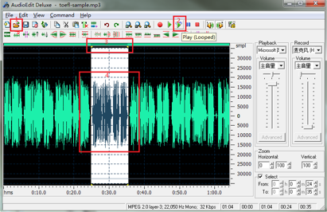

# فصل سوم: تلفظ

تلفظ بسیار مهم است، اما واضح است که مهم‌ترین نیست در ۱۷ آوریل ۲۰۰۹، دیوید لترمن (David Letterman) میزبان جو وانگ (Joe Wong) بود. اکنون با جستجوی "جو وانگ" در یوکو می‌توانید ویدئوهای زیادی پیدا کنید.

جو وانگ بسیار لاغر و با عینکی بر چشم، چهره‌ای بی‌حال دارد. اما به محض اینکه دهانش را باز کرد، تنها با یک جمله تمام حضار را به خنده وا داشت. در شش دقیقه بعد، با شوخی‌هایی که ترجمه‌شان به چینی طعم خود را از دست می‌دهد (شوخی‌های سبک آمریکایی)، مخاطبان را به شدت خنداند و چندین بار با کف‌زنی و تشویق مواجه شد. در نهایت، حتی سکوت او نیز به مایه‌ی خنده تبدیل شد - این نشان دهنده استادی اوست. این جو وانگ که به یکباره مشهور شد، در سال ۱۹۷۰ در شهر بایشان، استان جیلین چین به دنیا آمد؛ در دانشگاه جیلین در رشته شیمی تحصیل کرد و در سال ۱۹۹۴ برای تحصیل به آمریکا رفت و در سال ۱۹۹۹ مدرک دکترای بیوشیمی از دانشگاه رایس را دریافت کرد.

جو وانگ با لهجه غلیظ چینی خود، مخاطبان آمریکایی را تسخیر کرد. این برای بیشتر دانش‌آموزان چینی که به شدت در حال یادگیری انگلیسی هستند، عجیب است. از دوران دبستان، چه معلمان و چه دانش‌آموزان، عقیده رایج این بوده که "تلفظ باید استاندارد باشد". بسیاری از معلمان به خاطر توانایی‌شان در تلفظ "استاندارد" آمریکایی یا بریتانیایی افتخار می‌کنند و مورد حسادت قرار می‌گیرند. هم دانش‌آموزان و هم معلمان، اغلب در مورد اینکه باید "لهجه آمریکایی" یا "لهجه بریتانیایی" را یاد بگیرند بحث می‌کنند، حتی گاه‌گاهی این بحث‌ها به تنش می‌انجامد.

دانش‌آموزان چینی اغلب نه اینکه نتوانند به انگلیسی صحبت کنند، نه اینکه نخواهند، و نه اینکه نتوانند، بلکه جرأت نمی‌کنند. چرا جرأت نمی‌کنند؟ دلایل زیادی وجود دارد. یکی از رایج‌ترین این دلایل ترس از تلفظ نااستاندارد است. اما آیا تلفظ ناصحیح در یادگیری زبان دوم امری طبیعی نیست؟ حتی در زبان مادری خود، ما زمان زیادی صرف کردیم تا بتوانیم به طور تقریباً واضح صحبت کنیم. وقتی شما توانستید به زبان مادری خود به وضوح ابراز خود را انجام دهید، چند ساله بودید؟ پس چرا انتظار داریم که فردی از همان ابتدا بتواند با زبان دوم خود به طور واضح و دقیق ابراز وجود کند؟ و همچنین باید "تلفظ استاندارد" داشته باشد؟

بیایید امتحان کنیم، از ده واژه چینی زیر، چند تایی را می‌توانید به طور استاندارد بخوانید؟

بیوزی، فیوان، جیوو، کیانلی، گوودانگ، ویجی، لیانلی، بیبی، کینگ بو زی جین، رنتسای جی جی باز کنید چشمان خود را و به دنیای اطرافمان نگاه کنید. در واقع، اکثریت قریب به اتفاق افرادی که زبان مادری خود را به کار می‌برند، تلفظ استاندارد ندارند. اگر باور نمی‌کنید، ابتدا خودتان را و سپس تعداد افراد اطرافتان که فرق بین تلفظ پیشانی-زبان و پس‌زبان را نمی‌دانند، بررسی کنید. حتی اگر در پکن (که گفته می‌شود قلب مادری چین و استاندارد تلفظ چینی به شمار می‌رود) زندگی کنید، هر روز می‌توانید لهجه‌های مختلفی را بشنوید. در کشور ما، چه درصدی از مردم می‌توانند به طور استاندارد و دلنشین پوتونگهوا (ماندارین چینی) صحبت کنند؟ آیا ۱٪ هم هست؟ به دانشکده‌ی رادیو و تلویزیون سری بزنید، مجریان حرفه‌ای (که همگی بدون شک از زبان مادری استفاده می‌کنند) چقدر زمان و انرژی صرف می‌کنند تا خود را به سطح استاندارد برسانند؟ چین در این زمینه چنین است و کشورهای خارجی نیز در این مورد تفاوت چندانی ندارند. در کشورهای انگلیسی‌زبان نیز، کمتر از ۱٪ افراد می‌توانند به یک لهجه استاندارد و دلنشین خاص صحبت کنند.

در تمام دنیا همه زبان‌ها این‌گونه هستند، هر زبانی دارای لهجه‌های مختلفی است. انگلیسی شاید زبانی باشد که در سراسر کره زمین بیشترین لهجه را دارد. در ایالات متحده، تفاوت لهجه جنوب کالیفرنیا و شمال کالیفرنیا بسیار متفاوت است، تقریباً معادل تفاوت در گویش چینی بین مردم شاندونگ و شانشی در چین. البته تفاوت تلفظ بین مردم نیویورک و دیترویت هم بسیار قابل توجه است. در لندن، تفاوت لهجه‌های شرقی و جنوبی بسیار آشکار است. دیگر نیازی به گفتن نیست که "لهجه اسکاتلندی"، "لهجه کانادایی"، "لهجه استرالیایی"، "لهجه نیوزیلندی"، "لهجه هندی" و غیره وجود دارد ...
پل مایر (paulmeier.com) یک متخصص آموزش صدا و لهجه معروف جهانی است، بسیاری از بازیگرانی که به هالیوود می‌روند برای رفع "لهجه بیگانه" خود و یادگیری "انگلیسی محلی" اصیل از او کمک می‌گیرند. شاگردان او شامل (فهرست زیر تنها بخش کوچکی از آن‌ها است):

John Ales, Jonathan Brandis, A.J. Buckley,Jewel Kilcher, Jim Caviezel, Simon Baker Denny, Peter Coyote, Stewart Finlay-McLennan, Louise Fletcher, Bill Irwin, Gabrielle Fitzpatrick, Diana Hardcastle, Tom Hulce, Kris Kristofferson, Elizabeth Lackey, Tobey Maguire, Stephen Mailer, Terrence Mann, Callum Keith Rennie, Jonathan Rhys Meyers, Kim Myers, Mark Ruffalo, Skeet Ulrich, Celia Weston, David Wenham, Valerie Wildman, Peter Wingfield, Tom Wilkinson, Jeffrey Wright…

در وب سایت پل مایر، صفحه ای با نمونه هایی از گویش های انگلیسی با لهجه های مختلف وجود دارد، از جمله:

• Cockney

• Hampshire

• Irish

• Liverpool

• Northern Ireland

• Scottish

• Welsh

• Yorkshire; American Southern (Kentucky/Tennessee)

• Deep South (Alabama, Georgia, Louisiana, and Mississippi)

• Down East New England

• General New York

• South Boston…

تقریبا هیچ یک از این انواع در دانش‌آموزانی که سال‌ها در چین بزرگ شده‌اند و فقط به "یک نوع تلفظ" عادت کرده‌اند، قابل فهم نیست. در این صفحه همچنین می‌توان نمونه‌های صوتی از گویش‌های مختلف را پیدا کرد و خوانندگان می‌توانند برای شنیدن دقیق به آنها گوش دهند. سپس دوباره فکر کنید، آیا واقعاً نیازی به یک "استاندارد" مشخص هست؟ حتی اگر واقعاً نیاز باشد، کدام "استاندارد" باید استفاده شود؟

قطعاً بسیاری از مردم با دیدگاه "تلفظ چندان مهم نیست" مخالفت خواهند کرد، اما این مخالفت مانع از صحت و اهمیت این نظر نمی‌شود. در کلاس‌های انگلیسی، تاکید بیش از حد معلمان بر "تلفظ استاندارد"، حتی به قیمت مسخره کردن برخی "نمونه‌های کلاسیک"، در واقع مانع پیشرفت دانش‌آموزان می‌شود، هرچند این قصد معلمان نیست. اولاً، ممکن است "تلفظ استاندارد" واقعاً وجود نداشته باشد. هر فردی دارای خط صوتی و تمبر صدای متفاوتی است، پس چگونه می‌توانیم "یک استاندارد یکنواخت" داشته باشیم؟ به خصوص در هنگام استفاده از زبان خارجی. ثانیاً، چون خود انگلیسی زبانی است که بیشترین "لهجه‌ها" را در جهان دارد (و نه فقط یکی از آنها)، اگر تلفظ "استاندارد" نباشد، نباید انگلیسی صحبت کرد، پس ایرلندی‌ها، کانادایی‌ها و هندی‌ها نباید انگلیسی صحبت کنند - چرا که آنها نه "استاندارد آمریکایی" و نه "استاندارد بریتانیایی" را به کار نمی‌برند.

من منظورم این نیست که تلفظ مهم نیست، بلکه می‌خواهم بگویم که تنها یکی از عوامل متعدد بیان خوب است. در برخی موارد، افرادی که تلفظ خوبی ندارند (و حتی نمی‌توانند استاندارد باشند) اما می‌توانند به راحتی ابراز وجود کنند، شایسته تحسین هستند (مانند هوانگ شی)، زیرا آنها از مدت‌ها پیش شروع به حرکت کرده‌اند، نه مانند اکثر مردم که "همیشه" در نقطه آغاز مانده‌اند.

بنابراین، به عنوان کسی که انگلیسی را به عنوان زبان دوم استفاده می‌کند، نیازی نیست به خاطر تلفظ نااستاندارد، ناخوشایند یا نامفهوم خود احساس حقارت کنید، زیرا این امر طبیعی، عادی و اجتناب ناپذیر است. استفاده از زبان، اساساً به منظور برقراری ارتباط است. بدانید که فقط تلفظ استاندارد به معنای توانایی ارتباط موثر نیست. ارتباط موثر نیازمند به کارگیری واژه‌ها، دستور زبان، منطق، محتوا و سایر عوامل است و تمام این عوامل ذکر شده از "تلفظ استاندارد" مهم‌تر هستند. تصور کنید، هنگامی که سازمان ملل جلسه دارد، آیا هر نماینده کشور از "تلفظ استاندارد بریتانیایی" یا "تلفظ استاندارد آمریکایی" استفاده می‌کند؟ علیرغم اینکه هر نماینده کشور باید به زبان انگلیسی صحبت کند، اما همه آنها با لهجه خاص خود صحبت می‌کنند، اما هرگز مانع ارتباط موثر نشده است.

به عنوان شخص استفاده‌کننده از زبان انگلیسی، نباید توسط معلمان زبان انگلیسی گمراه شوید. به عنوان معلمان، در چارچوب محصولات آموزشی خود، بدون شک به "صحیح"، "دقیق" و "استاندارد" تأکید می‌کنند - بدون توجه به این که آیا واقعاً "صحیح"، "دقیق" و "استاندارد" هستند یا خیر. گاهی اوقات فکر می‌کنم که این مسئله بسیار ناراحت‌کننده است، بیشتر معلمان مضطرب می‌شوند و ترتیباتی برای خود ایجاد می‌کنند، این اتفاق نه به خاطر تشویق به پیشرفت است، بلکه به علت تامین انتظارات "مصرف‌کنندگان" که در واقعیت منطقی نیستند انجام می‌دهند. معلمان زبان انگلیسی هم انسان‌اند و بسیاری از آن‌ها همان محدودیت‌های روانی یا انسانی همانند اکثر افراد دیگر دارند. زمانی که یک فرد قادر به انجام کاری نیست، ترتیب می‌دهد و تا جایی که به خود اعتماد کرده به تماشای این ترتیب‌ها ادامه می‌دهد - پس از آن دیگر نیازی به ترتیب نیست چرا که به حد "صادقانه مصنوعی" رسیده است. معلمانی که در کلاس‌های خود به "تلفظ استاندارد" تأکید می‌کنند (حتی اگر خودشان تلفظ واقعی استاندارد داشته باشند)، در واقعیت به این نکته فکر نمی‌کنند که چه تأثیرات جانبی دارد - افراد دانشجو را ترساندند، اما خود به "ادب" یا "ترس" دست پیدا کردند و در نتیجه دانشجویان به مشکلات روانی جدی در ارتباط با یادگیری زبان انگلیسی روبرو شدند.

## ما کاملاً توانایی بهبود چشمگیر تلفظ را داریم

بیایید دوباره به واقعیت‌های علمی نگاه کنیم. تعداد دقیق زبان‌های موجود در جهان نامشخص است، اما تخمین زده می‌شود که بیش از 6700 زبان وجود دارد و تعداد صداهای به کار رفته در این زبان‌ها حدوداً 6000 نوع است. دکتر پاتریشیا کی. کول، استاد بخش علوم شنوایی و گفتار در دانشگاه واشنگتن، تحقیقاتش نشان می‌دهد که نوزادان تازه متولد شده واقعاً توانایی یادگیری هر یک از زبان‌های موجود در جهان را دارند؛ به عبارت دیگر، نوزادان تازه متولد شده در واقع «شهروندان جهانی» هستند و مغز آن‌ها قادر به پردازش هر یک از حدود 6000 صدای مورد استفاده در آن 6700 زبان است.
حدود 6 ماهگی، نوزادان شروع به توجه بیشتر به زبان مادری خود می‌کنند. توضیحات خانم کول به این شرح است:

در این زمان، نوزادان «قدرت تشخیص صدا» را از دست نمی‌دهند، بلکه مغز آن‌ها شروع به توسعه یک سیستم فیلترینگ می‌کند که قادر است صداهای بی‌ربط به زبان مادری را حذف کند، یا صداهایی که شبیه صداهای موجود در زبان مادری هستند را در یک دسته قرار دهد. بنابراین، نتیجه نهایی این است که آن‌ها دیگر قادر به تشخیص برخی صداها و تفاوت‌های میان آن‌ها نیستند - البته صداهایی که به زبان مادری مربوط نیستند. در ادامه بحث، دلیل دیگری برای نیاز مغز به این نوع فیلتر وجود دارد و آن این است که مغز باید صدای یکسانی که توسط افراد با تن صدای متفاوت بیان می‌شود را به یک دسته تخصیص دهد تا بتواند به درستی زبان را درک کند.

در واقع، هر زبان تنها از تعداد محدودی از صداها استفاده می‌کند. زبان سوئدی از 16 حرف صدادار استفاده می‌کند، زبان انگلیسی از 8 حرف صدادار و زبان ژاپنی تنها از 5 حرف صدادار؛ در حالی که زبان چینی از 6 حرف صدادار استفاده می‌کند - یکی بیشتر از زبان ژاپنی، که این امر تا حدودی توضیح می‌دهد چرا چینی‌ها در یادگیری تلفظ زبان انگلیسی نسبت به ژاپنی‌ها کمی راحت‌تر هستند. در برخی مناطق کشور ما، برخی افراد قادر به تشخیص تفاوت بین حروف «r» و «l» نیستند و در شنوایی آن‌ها (بزرگسالان)، کلماتی مانند «row» و «low» یا «rake» و «lake» فرقی ندارند. حدود 11 ماهگی، سیستم فیلتر مغز نوزادان بسیار کامل شده و در نتیجه آن‌ها از «شهروندان جهانی» به «شهروندان یک زبان خاص» تبدیل می‌شوند. تا 18 ماهگی، نوزادان به تدریج شروع به توجه به پدیده‌های دستوری و الگوهای زبانی می‌کنند، مثلاً می‌توانند حدس بزنند که کلماتی که به «-ing» یا «-ed» ختم می‌شوند احتمالاً افعال هستند.

جالب‌ترین بخش تحقیقات خانم کول این است که او بیشتر به بررسی فرآیند رشد مغزی نوزادانی که در محیط‌های چندزبانه بزرگ می‌شوند پرداخته است. برخی نواحی در جهان به طور طبیعی «مناطق چندزبانه» هستند، مانند لوکزامبورگ در اروپا، و همچنین بسیاری از مناطق که اقلیت‌های قومی در کشور ما ساکن هستند. کودکانی که در این مناطق بزرگ می‌شوند، اصلی‌ترین تأثیر را بر «مکانیزم فیلترینگ» مغز خود می‌گذارند. به دلیل اینکه آن‌ها از کودکی در معرض تحریکات متعدد زبانی قرار می‌گیرند، «فیلترهای» آن‌ها با کسانی که تنها یک زبان را به کار می‌برند متفاوت است، بنابراین آن‌ها قادر به تشخیص تعداد بیشتری از صداها هستند.

این نتایج تحقیق به واضحی نمایانگر دلایلی است که طرفداران "دوره حیاتی یادگیری زبان" به عنوان دلیلی برای حمایت از دیدگاه خود می‌اندیشند. چرا که واقعیت اینجاست که یک تحقیق دیگر نشان می‌دهد که یادگیری زبان دوم پس از بزرگ شدن بسیار دشوارتر می‌شود. اما نتایج همچنین می‌توانند اثبات کنند که "ما در اصل قادر به یادگیری هر زبانی هستیم"، "ما همچنان قادر به یادگیری هر زبانی هستیم"، تنها این است که ما باید زمانی برای تنظیم "فیلترهای" خود صرف کنیم یا حتی ممکن است "فیلترهای" خود را مجدداً ساخته و تنظیم کنیم — چرا که مغز قابل تغییر است، حتی مغز می‌تواند مجدداً ترتیب داده شود. تنها یک مسئله زمان است.

بزرگترین اشتباه افرادی که از "دوره حیاتی یادگیری زبان" سخن می‌گویند، این است که آن‌ها "زبان" را با "صدا" همتا می‌سازند — که به وضوح دو چیز متفاوت هستند. در واقعیت، با وجود وجود دوره حیاتی، تأثیر آن دقیقاً در "صدا" است و نه در "زبان". صدا تنها یک جنبه از زبان است. افراد جوان تر در واقعیت تنها قادر به یادگیری صدا هستند و سایر جنبه‌های زبان به هیچ وجه به همین شکل نیستند. به عنوان مثال، یادگیری واژگان به طور مشخص به مرور زمان سریع‌تر است، جوانان قوی‌تر از نوجوانان هستند، و افراد مسن (کسانی که تا پیری در حال یادگیری هستند) قوی‌تر از جوانان هستند. اساساً، هرچقدر دانش فرد بزرگتر باشد، یادگیری مفاهیم و واژگان جدید برای او آسان‌تر است. به عنوان مثال دیگر، قابلیت منطقی برای استفاده از کلمات، پایه‌ای مهم برای استفاده از زبان است و افرادی که دوره‌های تمرین منطق ندارند، محدودیت‌های زیادی در استفاده از زبان و متن در اختیار دارند. حتی اگر صدای زبان "استاندارد" باشد، یادگیری زبان و یادگیری صدا دو چیز متفاوت هستند. به طور خلاصه، حتی زبان به تنهایی بی‌معناست، چرا که در نهایت تنها یک وسیله و رسانه برای ثبت، انتقال و تبادل افکار است.

در نظر محققان، یادگیری یک مهارت در واقعیت به عنوان فرآیند ایجاد اتصالات بین سلول‌های عصبی در مغز تعبیر می‌شود. مایکل مرزنیچ، استاد بازنشسته افتخاری دانشگاه کالیفرنیا، معتقد است که برای یادگیری هر مهارت جدید، باید میلیون‌ها اتصال جدید بین سلول‌های عصبی مغز ایجاد شود. این وظیفه پرکار و زمان‌بر بوده و در طی این فرآیند کارآمدی ناپذیر به نظر می‌آید. در این فرآیند زمان‌بر و پیچیده، یک مفهوم به نام "دوره سقفی" نیز وجود دارد — به این معنا که در یک بازه زمانی خاص، به نظر می‌آید هیچ توسعه قابل مشاهده‌ای رخ نداده است، مهم نیست چقدر تمرین کرده باشید. پدیدآورنده نوروپلاستیسیته، پل بخ-ی-ریتا نیز معتقد است که "دوره سقفی" تنها یک نمایانگر است و در این دوره مغز به واقعیت رشد خود را متوقف نمی‌کند؛ اتصالات جدید بین سلول‌های عصبی به صورت مداوم تقویت می‌شوند. اگر تمرین متوقف شود، مغز به اصول "اگر استفاده نشود، از دست برود" پیروی می‌کند و اتصالات بی‌فایده را دور می‌اندازد. پس چقدر زمان لازم است تا اتصالات بین سلول‌های عصبی به حدی تقویت شوند که "سخت به دور انداختن" شوند؟ توضیح پل بخ-ی-ریتا این است که "شش ماه" است — این مدت بسیار دشوار به عنوان یک حد زمانی مقایسه شده با مدت بارداری معمول انسان‌ها.

"تغییر" فیلتر صدای خودتان امکان‌پذیر است، حتی "بازسازی" فیلتر خودتان هم امکان‌پذیر است. اما چرا بیشتر مردم نمی‌توانند این کار را انجام دهند؟ توضیحات پروفسور پل بَش یریتا به ما یک نشانه نسبتاً واضح می‌دهد. بیشتر مردم به سختی می‌توانند بیش از شش ماه پایدار باشند. متأسفانه برای آنهایی که پنج ماه پایدار می‌شوند، واقعاً ناراحت کننده است، زیرا آنها به رغم اینکه در حال عبور از دوره پلتفرم هستند، اما به دلیل ترک کردن کمی زودتر، به "ترک کامل کار" منتهی می‌شوند - این سیناپس‌های سلول‌های عصبی مغز نمی‌دانند چه افتضاح هستند، تنها یک اصل دارند: "اگر استفاده نمی‌شود، ترک می‌شود". اگر می‌خواهید بازسازی کنید، متأسفانه همچنان نیاز به حداقل شش ماه دارید - و این زمان با افزایش سن تان بیشتر و بیشتر خواهد شد."

## بزرگترین مانع: ترس از مسخره شدن

ترس از صحبت کردن به زبان انگلیسی به دلیل نگرانی از مسخره شدن توسط دیگران نیز یکی دیگر از دلایل مهم است. این واقعاً آزاردهنده است. اما فکر کنید: آیا یک فرد عادی قدم‌های لرزان یک نوزاد را مسخره می‌کند؟ نه. آیا یک فرد عادی معلولان را مسخره می‌کند؟ نه، نباید این کار را کرد. پس، دوباره نگاه کنید، آیا مسخره کردن کسی که لهجه‌ی خارجی نامناسب یا ناخوشایند دارد منطقی است؟ آیا مسخره کردن کسی که تمام عمر با لهجه صحبت می‌کند و نمی‌تواند آن را تغییر دهد، منطقی است؟

هر کسی در اطراف خود افرادی را دارد که دوست دارند دیگران را مسخره کنند. اما، مسخره کردن دیگران احمقانه است. اگر فقط به این دلیل که کسی در زمینه‌ای بهتر از دیگری است یا کاری را بهتر انجام می‌دهد می‌توان دیگران را مسخره کرد، پس آن شخص نیز در نهایت توسط دیگران مسخره خواهد شد، چرا که هیچ کس نمی‌تواند در هر زمینه‌ای از دیگران بهتر باشد. مسخره کردن دیگران همیشه برای آن‌ها مخرب است و برای خود فرد نیز سازنده نیست، زیرا مسخره کردن دیگران خود به خود سطح فرد را بالا نمی‌برد، در بهترین حالت فقط توهمی از خوشحالی را به دست می‌آورد.
نوزادان ابتدا یاد می‌گیرند که گوش دهند و سپس صحبت کنند، دلیل اصلی این است که "صحبت کردن" از "شنیدن" سخت‌تر است - "شنیدن" شاید فقط به "تشخیص" نیاز داشته باشد، اما "صحبت کردن" نیاز به استفاده از عضو دیگری برای تولید صدا دارد و علاوه بر آن اغلب نیاز به اصلاح و تنظیم دارد. بنابراین، در زندگی روزمره، فردی که حتی کمی اساس دارد می‌تواند تشخیص دهد که آیا لهجه خارجی دیگران خوب است یا نه، صرف نظر از اینکه خودش چگونه صحبت می‌کند. جالب این است که اکثر مسخره کردن‌ها دقیقاً از این احساس "با خود مهربان، با دیگران سخت‌گیر" ناشی می‌شود که اساساً بی‌ارزش است، حتی برای کسی که مسخره می‌کند نیز فقط توهم خوشحالی کاذب به دست می‌آید.

افراد واقعاً متمدن، دیگران را مسخره نمی‌کنند. افراد متمدن ممکن است در حالت عصبانیت فحش دهند یا کلمات رکیک بگویند، اما آن‌ها به راحتی به کسی توهین نمی‌کنند و به هیچ وجه دیگران را مسخره نمی‌کنند، زیرا آن‌ها از قبل یاد گرفته‌اند که چگونه نقد سازنده داشته باشند و احترام به دیگران و خودشان را می‌دانند. تنها افراد نامتمدن هستند که دیگران را مسخره می‌کنند.

کسانی که بی‌دلیل دیگران را مسخره می‌کنند ننگین هستند، حتی بی‌فرهنگی‌شان از تف کردن در مکان‌های عمومی بدتر است.

افرادی که در کارهایشان موفق هستند، به سختی می‌توانند دیگران را مسخره کنند. زیرا آن‌ها می‌دانند که انجام خوب یک کار چقدر دشوار است - آن‌ها خودشان تجربه کرده‌اند. یک دانشجویی از استاد بزرگ ویولنسل، پابلو کازالس، پرسید چرا هنوز هر روز برای مدت زمان طولانی تمرین می‌کند، استاد گفت: "چون من هر روز پیشرفت می‌کنم!" سخت است تصور کرد که چنین استادی چه زمان و میلی برای مسخره کردن دیگران داشته باشد. آقای می‌ین فانگ در سال‌های آخر عمرش به شاگردانش آواز خواندن آموخت و هرگز آن‌ها را سرزنش نکرد. هر زمان که آن‌ها اشتباهی می‌کردند، آقای فانگ می‌گفت: "دوباره تمرین کن، این کار سخت است..."

بنابراین واقعاً نباید به تمسخر دیگران اهمیت دهید. اگر خطا کردید، می‌توانید آن را اصلاح کنید. اگر نتوانید تصحیح کنید، تنها کافی است که به دیگران آسیب نرسانید — واقعیت این است که شما به راحتی نمی‌توانید با تلفظ انگلیسی با لهجه کمی که دارید، به دیگران آسیب برسانید. اگر تلفظ انگلیسی شما کمی نادرست باشد یا لهجه‌ای داشته باشد، این کاملاً اشتباه شما نیست، شما هیچ‌وقت واقعاً هیچ‌کس را به دلیل این مسئله آزار نداده‌اید و احتمالاً هم نخواهید داد. افرادی که شما را تمسخر می‌کنند، باید خودشان تمسخر شوند، تنها به دلیل اینکه شما فرد مهذبی هستید و نمی‌توانید با آن‌ها برابری کنید. در مورد تمسخر دیگران، اگر شما واقعاً اهمیت بدهید، آن‌ها به اهداف خود دست یافته‌اند، چرا که شما آسیب دیده‌اید و آن‌ها از این خبر خوشحال هستند. اگر کاملاً بی‌توجه باشید، آن‌ها دیگر انگیزه ندارند، چرا که نمی‌توانند لذت ببرند — افراد ضعیف تنها می‌توانند خودشان عصبانی شوند یا به خودشان عصبی کنند.

## بیشتر گوش دادن، بیشتر گوش دادن و دوباره بیشتر گوش دادن

برای بازسازی صدای خود، باید از شروع به ساختار یا بازسازی فیلتر صدای خود شروع کنیم. باید توانایی تشخیص صداهای استفاده شده در زبان مقصد (مثلاً انگلیسی) را دوباره یاد بگیریم. زیرا ما به سختی می‌توانیم صداهایی که قادر به تمییز دادن آن‌ها نیستیم، بگوییم. آموزش‌های گفتاری مختلف معمولاً به جز ایجاد آرامش روحی، به تازگی تأثیر معنی‌داری ندارند. بهترین روش واقعی افزایش ورودی شنوایی به صورت رایگان است - افزایش قابل توجهی در میزان گوش دادن.

در فرآیند یادگیری زبان مادری‌امان، تقریباً تمام روزه با تحریک‌های صوتی زبان مادری روبرو می‌شویم، اما در یادگیری زبان خارجی نسبت به این مسئله کمتر توجه می‌شود. به نظر من، اغلب دانشجویان، با وجود ادعاهایی که می‌کنند که بیش از ده سال انگلیسی خوانده‌اند، در واقعیت حداکثر دو ساعت در روز به گوش دادن انگلیسی اختصاص نمی‌دهند و هیچگاه به مدت طولانی ادامه نمی‌دهند. برای به دست آوردن نتایج بهتر، باید ورودی بسیار زیادی داشته باشیم و همانطور که قبلاً گفته شد، حداقل باید شش ماه متوالی ادامه داد.

بسیاری از افراد احتمالاً فکر نمی‌کنند که در اینجا "تسلط بر گوش دادن" مهم نیست. هدف افزایش چشمه‌های ورودی شنوایی به منظور بازسازی توانایی تشخیص صوتی است و تاکیدی بر درک متن ندارد. نوزادان تا ۱۸ ماهگی، فیلتر صدای مادری خود را ساخته‌اند، اما در واقعیت قادر به کامل درک محتوای روزانه‌ای که می‌شنوند نیستند. نتایج تحقیقات دکتر کوهل (Kuhl) ما را به این فکر انداخته است که تدریس زبان انگلیسی به کودکان به صورت رایگان امکان پذیر است: اگر والدین انگلیسی نداشته باشند، مهم نیست، فقط کافی است در محیط فعالیت کودکان به طور مداوم صداهای مختلف انگلیسی را پخش کنند (شعر کودکانه، داستان، مجموعه‌های تلویزیونی و غیره) و به مدت طولانی ادامه دهند. تا زمانی که این کار انجام شود، کودکان به واقعیت نیازی به حضور در کلاس‌های آموزشی ندارند و تا زمانی که وارد مدرسه می‌شوند، "فیلتر صدای دوزبانه‌شان" باید قطعی شده باشد. در واقع، من شک دارم که تدریس‌های مختلف زبان انگلیسی برای کودکان زمان زیادی را که اصولاً می‌توانستند از آن برای یادگیری مهارت‌های دیگر استفاده کنند، تصرف کرده‌اند و در نتیجه توسعه مغز کودکان را محدود کرده‌اند. اما نمی‌توان انتظار داشت که فقط با گوش دادن به ضبط‌ها و تماشای تلویزیون، کودکان بتوانند زبان خارجی یاد بگیرند - همانطور که قبلاً گفته شد، یادگیری صدا و یادگیری زبان دو مسئله متفاوت است. برای بزرگ‌ترها هم این اصول معتبر است، افزایش چشمه‌های ورودی شنوایی به منظور بازسازی فیلتر صدای خود به سرعت است. پس از آن، برای پیشرفت، "تسلط بر گوش دادن" بسیار مهم است. چرا که تنها با تسلط بر گوش دادن می‌توان تمرکز کرد و تمرکز تمامی مبانی یادگیری است.

یک مورد دیگری که بسیاری از مردم به آن فکر نمی‌کنند این است که "پیشرفت تدریجی" به هیچ وجه استراتژی خوبی نیست، حداقل در زمان "بازسازی فیلتر صدا" اینگونه نیست. باید از ابتدا به مواد با سرعت صدای عادی گوش داد. برنامه معروف "ویس آمریکا" (VOA) برنامه‌ای به نام "انگلیسی ویژه" دارد که یکی از منابع "مقدمه" یا "متوسط" برای یادگیری انگلیسی برای بسیاری از مردم چینی است. در یک زمانی، بسیاری از افراد به خطر افتادن به عنوان "گوش کردن به دشمن" را به خریدن و گوش دادن به این برنامه برای یادگیری انگلیسی بر می‌داشتند. من باور دارم که این برنامه با طراحی اولیه خود مفید بوده است، این برنامه اعتقاد داشت که یادگیری انگلیسی باید "پیشرفت تدریجی" داشته باشد، زبان عادی با سرعت و اصطلاحات عادی برای مبتدیان بسیار دشوار است؛ بنابراین، تنها حدود ۱۵۰۰ کلمه اساسی را استفاده می‌کند، تنها از ساختارهای دستوری پایه استفاده می‌کند و صدای آن را با سرعت کمتری پخش می‌کند. اما من شک دارم که واقعیتی که این برنامه در نظر گرفته به اندازه‌ی اثر آن است. مشاهده من این است که بسیاری از افراد به محض شروع به گوش دادن به "انگلیسی ویژه"، به سرعت نمی‌توانند از آن دست بکشند - زیرا احساس می‌کنند که "می‌توانند به طور کامل بفهمند"؛ بعد از مدتی، انتقال به گوش دادن به CNN یا منابع دیگر با سرعت صدای عادی، به سختی انجام می‌شود و بعداً "حس" می‌کنند که "اساس‌هایشان هنوز کافی نیست"، بنابراین دوباره به "انگلیسی ویژه" باز می‌گردند و چندین سال می‌گذرد که آن را گوش می‌دهند. دلیل مهمی که همانند مورد قبلی اشاره شده است: در این زمان، این موضوع مهم نیست که آیا می‌توان گوش داد یا نه؛ واقعیتاً مهم این است که باید بخواهیم بخشی از مغزمان که برای ورودی شنوایی مسئول است، به مدت طولانی به اندازه کافی از تحریک‌های صوتی انگلیسی بپذیرد.

باید یک مترجم راه اندازی کنید تا این متن را به زبان فارسی ترجمه کند و آن را به عنوان یک کتاب منتشر کنید:

"یک پیشنهاد به نظر می‌رسد که به نظر غیرمنطقی می‌آید "فقط به ضبط‌های استاندارد گوش ندهید". بسیاری از افراد تنها به دلیل اینکه روش‌های آموزشی آنها با "روش طبیعی یادگیری زبان" تضاد دارد، در یادگیری زبان به نتیجه نمی‌رسند. دلیل وجود "فیلتر صدای مادری" در مغز نوزادان، علاوه بر اینکه این کار را برای درک زبان مادری آسان‌تر می‌کند، دلیل دیگری هم دارد: مغز باید با تغییرات بسیار زیاد در یک سیگنال صوتی مشابه کار کند - زیرا نوزادان هر روز با افراد مختلفی راه اندازی می‌کنند که از همان سیگنال صوتی استفاده می‌کنند، و هر کدام از این افراد ممکن است دارای تفاوت‌های خاصی در کیفیت، نوع و تغییر صدا باشند. بنابراین، مغز باید دارای یک فیلتر باشد که توانایی گروه‌بندی تغییرات مختلف سیگنال صوتی ورودی را به یک دسته تصوری داشته باشد - تنها به این شکل می‌تواند بدون اشتباه زیاد به ورودی‌های صوتی پاسخ دهد. بنابراین، در حالی که میزان ورودی‌های شنیداری انگلیسی خود را بالا ببرید، باید با کیفیت‌ها، نوع‌ها، تغییرات و حتی لهجه‌های مختلف آشنا شوید. از این دیدگاه، برنامه‌های رادیویی به اندازه‌ای که کتاب‌های صوتی استاندارد قوی‌تر هستند، چون در آنها بسیاری از افراد صحبت می‌کنند و تنها یک "صدای استاندارد" نیست. به علاوه، من به دانش‌آموزان خود اغلب توصیه می‌کنم که ورودی‌های خود را تنها به "لهجه آمریکایی استاندارد" یا "لهجه بریتانیایی استاندارد" محدود نکنند؛ در واقعیت، هر نوع لهجه‌ای را می‌توانید گوش کنید، حتی "انگلیسی سیاهپوستانه" با ویژگی‌های خاص خود. من به طور معمول توصیه می‌کنم به برنامه‌های پخش خبری سی‌ان‌ان مراجعه کنید، زیرا در آنها انواع مختلفی از انگلیسی با لهجه‌های مختلف وجود دارد، واقعاً می‌تواند شعور شما را از زبان‌شناسی گسترش دهد.

بیش از بیست سال پیش، وسایل آموزش زبان بسیار عقب‌مانده بودند، کل کلاس از یک پخش‌کننده مگنتوفون دسکتاپ استفاده می‌کردند و تنها یک کاستی مغناطیسی در تمام نیم‌سال را به کار می‌بردند. امروزه دانش‌آموزان می‌توانند با هزینه کمی پخش‌کننده‌های MP3 که می‌توانند تعداد بی‌شماری محتوای آموزشی را ذخیره کنند، خریداری کنند، حتی می‌توانند با گوشی همراه خود MP3 پخش کنند، واقعاً آسان است. من خودم در طی ده سال گذشته هر روز به کتاب‌های صوتی گوش داده‌ام، وسایل آموزشی را تعویض کرده‌ام، از پخش‌کننده 32 مگابایتی نوآوری سنگاپور شروع شده، به PDA هیوپ PDA، به گوشی هوش مصنوعی اچ‌تی‌سی و در نهایت به آیفون فعلی. یک ترفند کوچک وجود دارد که هنگام گوش دادن به فایل‌های صوتی انگلیسی، هر دو گوش را با هدفون پوشاندن نیست - تنها یک گوش را با هدفون پوشانید. زیرا ورودی طبیعی زبان و ورودی هدفون متفاوت‌اند. در محیط طبیعی، ما هیچ‌گاه به زبان گوینده به صورت "تنها" نمی‌شنویم - همیشه با صداهای پس‌زمینه مختلفی همراه است. اما هنگام استفاده از هدفون، اساساً تنها "صدای خالص زبان" وجود دارد، که برای بازسازی فیلتر صوتی خود ما بهتر نیست. یکی از مزایای دیگر استفاده از تنها یک گوش هدفون این است که می‌توانید به مداوم گوش داده‌اید و گوش ها را آسیب نمی‌رساند.

همانطور که قبلاً اشاره کردم، حداقل باید شش ماه پایدار بمانید، من شخصاً توصیه می‌کنم که زمان ورودی روزانه شما کمتر از چهار ساعت نباشد - تنها کافی است شروع کنید تا متوجه شوید واقعاً دشوار نیست، زیرا "حتی اگر نفهمید هم مهم نیست". با گوش دادن بیشتر، به مرور زمان، حتی در شرایطی که نفهمید به نظر می‌آید، دشوارتر می‌شود. البته، حتی در ابتدا، برای بهبود نتایج، می‌توانید به طور آگاهانه سختی متن را تدریجاً افزایش دهید و بهتر است با مطالعه دقیق همراه شود. در این دوره تقریباً همه افراد احساس می‌کنند که بهبودی ندارند، اما این "احساس" بی‌اعتبار است - در واقعیت، احساسات ما تقریباً همیشه بی‌اعتبار هستند. نگاه کنید به دو خط راست زیر کدامیک بلندتر است؟"

حساسیت به طور طبیعی نشان می‌دهد که خط دوم زیرتر است، اما در واقعیت این دو خط به یکسان طول دارند. برخی افراد حتی فکر می‌کنند که دو مربع بالایی کوچک‌تر از دو مربع پایینی هستند، این هم اشتباه است؛ بعضی از افراد فکر می‌کنند که خط پایینی ضخیم‌تر از خط بالایی است، این هم اشتباه است. هرگاه که به دلیل احساس عقب‌نشینی و دلسردی از پیشرفت خود ناراحت می‌شوید، بهتر است به این تصویر فکر کنید و به خود یادآوری کنید که "احساسات معمولاً قابل اعتماد نیستند"، و سپس به توضیحات پروفسور پل بخ یریتا در مورد "دوران پلتفرم" فکر کنید. سپس به سرعت به حالت آرامی برگردید و به کارتان ادامه دهید.

## ابزارهای کمکی

علاوه بر این، اگر شما با عملکرد کامپیوتر آشنا باشید (که در واقعیت باید باشید)، می‌توانید به دنبال نرم‌افزارهای ویرایش صوتی به عنوان ابزارهای کمکی بگردید، مانند Cool Edit، Audio Edit Deluxe، Audacity و غیره. این نرم‌افزارها برای کاربران معادل "تجسم صوتی" فراهم می‌کنند، به آنها امکان می‌دهند تا با استفاده از نمودار صوتی، شکلک‌ها و اندازه‌های مختلف صدا را به وضوح مشاهده کنند. علاوه بر این، با استفاده از آنها به راحتی می‌توانید یک قسمت خاص از صدا (با تعیین دقیق نقاط شروع و پایان) را بارها و بارها تکرار کنید.

توضیح مختصر استفاده از AudioEdit همانطور که در تصویر نشان داده شده است:

فایل صوتی (mp3، wav) را باز کنید.

دکمه پخش مکرر را فشار دهید.

با کلیک چپ ماوس نقطه شروع را تعریف کرده و با کلیک راست ماوس نقطه پایان را تعریف کرده و یک قسمت از صدا را انتخاب کنید.

نشانگر ماوس را در ناحیه انتخاب شده قرار داده و با اسکرول ماوس صوت را بزرگنمایی یا کوچک‌نمایی کنید.

اگرچه بعد از بزرگ شدن (یا شروع به یادگیری جدی زبان انگلیسی پس از بالغ شدن) افراد نمی‌توانند به راحتی به تلفظ عالی دست پیدا کنند، اما با روش صحیح و تلاش صادقانه، همیشه امکان بهبود زیادی وجود دارد. من شخصی به این موضوع شاهدم. در کودکی، تلفظ انگلیسی من به عنوان خوب شناخته می‌شد، اما این نظر یکی از معلمان مدرسه متوسطه‌ام بود و اکنون که به آن فکر می‌کنم، به نظرم اصلاً درست نیست. بعداً به عنوان بسیاری از دانش‌آموزان داخلی که مدت‌ها هیچ وقت حتی یک کلمه انگلیسی نگفته‌ام، تا سال‌ها پس از فارغ‌التحصیلی از دانشگاه، به طور اشتباه به تدریس در موسسه آموزشی "نیو اورینت" شروع کردم و تلفظم بسیار بد بود. در ابتدا تدریس درس خواندن را آغاز کردم و سپس به تدریس درس نوشتن پرداختم و در این میان درس‌های مختلفی را هم تدریس کردم. هر چند که درس‌هایم بسیار خوب بود، اما تلفظ من همچنان مورد شمایل می‌آمد.

اگر بخواهم چیزی داشته باشم که خودم را خنداندنی کند، این است که به راحتی تحت تأثیر دیگران قرار نمی‌گیرم. این شاید به دلیل این باشد که من در عین ترتیب ندادن به نقاط ضعف خود، مهارت در خود راحت‌گیری دارم. اگر بدانید من زیبا نیستم، مهم نیست، در واقع مردان به زیبایی بیش از حد اهمیت نمی‌دهند (در واقعیت، حتی اگر بخواهم همچنان به زیبایی اهمیت بدهم، این تاثیر مثبتی نخواهد داشت)؛ اگر قدم کم است، کم چیز باشد، به هر حال انسان‌های بلندقد در لباس‌پوشی زیاده‌روی می‌کنند (در واقعیت، من می‌دانم که افراد بلندقد به خاطر قد بلندتر به عنوان افراد قابل اعتماد تر شناخته می‌شوند - این نتیجه تحقیقات روان‌شناسی است)؛ اگر تلفظم بد است، بد باشد، به هر حال من بدترین نیستم (آن زمان که در نیو اورینت بودم، بدترین کسی که می‌شناختم را نمی‌توانستم بگویم، در غیر این صورت ممکن بود او را اخراج کنند، هه هه؛ اکنون که از نیو اورینت جدا شده‌ام همچنان نمی‌توانم بگویم، در غیر این صورت ممکن است دیگران من را ناپسند بدانند، هه هه) - حتی اگر چقدر بد باشد، آیا بهتر از اکثر ژاپنی‌ها نیست؟
با این حال، من تلاش کردم تا تلفظ خود را با استفاده از تسلط بر ضبط‌های آزمون TOEFL بهبود ببخشم. در واقع زمان آموزش متمرکز واقعاً طولانی نبود، تقریباً سه ماه بود که بهبود قابل توجهی داشت. بعد از آن به مدت سال‌ها مختلف کتاب‌های الکترونیکی با صدا را گوش دادم و در یک چشم بهم زدن، سال‌ها از گذشته و دیگر کسی به دلیل تلفظ من مرا شمایل نمی‌آورد. شاید این به دلیل خستگی از شمایل زدن باشد یا شاید به دلیل این باشد که تلفظ من تقریباً بهبود یافته است - من فکر می‌کنم احتمال دوم بیشتر است. چرا که صحبت کردن یک موضوع است که با گفتن بهتر می‌شود.

## «بهتر است در قضاوت خود کمی انعطاف‌پذیر باشیم»

«سخت‌گیری به خود» یک عادت خوب است. اما، وقتی به دنبال بازسازی صدای خود هستیم، بهتر است «در قضاوت خود کمی انعطاف‌پذیر باشیم». در عمل، من حتی به دانشجویانم می‌گویم که اصل اول این است که (حداقل) موقتاً نباید بیش از حد به دنبال «استاندارد» بود - در واقع، دنبال کردن هم فایده‌ای ندارد، زیرا هیچ کس نمی‌تواند در مدت زمان کوتاه به اصطلاح «استاندارد» مورد نظر را بدست آورد.

عادات حرکتی دهان افرادی که از زبان‌های مختلف استفاده می‌کنند، بسیار متفاوت است. نوزادان تازه متولد شده قادر به صحبت کردن نیستند، زیرا هنوز نمی‌دانند چگونه باید از لب‌ها، زبان، گلو و تارهای صوتی خود استفاده کنند و همچنین نمی‌دانند باید چگونه جریان هوا را برای تولید اصوات مختلف کنترل کنند. آن‌ها باید به طور مکرر گوش دهند، مشاهده کنند، تشخیص دهند، تقلید کنند و اصلاحات لازم را انجام دهند تا بتوانند به آرامی شروع به صحبت کردن کنند. سپس، پس از چندین سال، حتی ممکن است طولانی‌تر، کودکان قادر خواهند بود به طور واضح صحبت کنند - البته هنوز هم بخش قابل توجهی از افراد شاید هرگز نتوانند به طور واضح صحبت کنند (مانند آقای جی-چو لین که بیشتر مردم با او آشنا هستند).

بین افرادی که از زبان‌های مختلف استفاده می‌کنند، عادات حرکات دهانی بسیار متفاوت هستند. نوزادان تازه متولد شده نمی‌توانند صحبت کنند، زیرا هنوز نمی‌دانند چگونه از لبها، زبان، حلق، سیم‌صدا و سایر اعضای حرکتی استفاده کنند و همچنین نمی‌دانند چگونه جریان هوا را کنترل کنند تا صداهای مختلفی تولید کنند. آنها باید بعد از گوش دادن، مشاهده، تشخیص، تقلید و اصلاح مکرر مراحلی را طی کنند تا بتوانند به تدریج شروع به گفتگو کنند. سپس باید چندین سال یا حتی بیشتر زمان برای کودکان طی شود تا بتوانند گفتگوی با دقت داشته باشند - البته باید بگویم که بسیاری از افراد از همان ابتدا هرگز نمی‌توانند به گفتگوی دقیق برسند (مثل آقای جی-هونگ زهو از مردم بسیار آشنا).

هنگامی که اعضای مختلفی که در ایجاد یک زبان شرکت می‌کنند، شروع به تطابق با یک زبان می‌کنند، به تدریج به عادات خاصی در انجام حرکات عادی عادی مشغول می‌شوند و به مرور زمان دشوارتر می‌شود انجام حرکاتی که در زمان استفاده از زبان مادری نمی‌توان انجام داد یا حتی استفاده نمی‌شود. هنگام صحبت به زبان خارجی، بعضی از حرکات دهانی دشوارتر به انجام می‌پیوندد و اعضای مختلف به طور ناخودآگاه تلاش می‌کنند تا یک حرکت نسبتاً نزدیک‌تر را انجام دهند و در نهایت صداهای متفاوتی تولید می‌کنند. به عنوان مثال، بسیاری از مردم کره‌ای به سختی می‌توانند صدای "v" را تولید کنند - زیرا این صدا در زبان آنها وجود ندارد، بنابراین هنگامی که آموزش تلفظ را از طریق آموزه‌های زبانی تمام می‌کنند، صداهایی که تولید می‌کنند همیشه "b" خواهد بود. این موضوع مشابه مشکلات بسیاری از مردم جنوبی است که نمی‌توانند حروف "f"، "n" را تولید کنند یا حتی تفاوت بین حروف بینی و حروف معمولی را تشخیص دهند، بنابراین ممکن است "پوست" را به جای "پو"، "زن" را به جای "الاغ" یا "تیم زنان" را به جای "دختران" تلفظ کنند.

من یک دوست کره‌ای دارم که همیشه کلمه "video" را به عنوان "bideo" تلفظ می‌کند، در ابتدا من به این تلفظ عادت نداشتم و یک یا دو بار به طور ناخودآگاه او را تصحیح کردم، اما متوجه شدم که او به نظر می‌آید حتی نمی‌فهمد که کلمه "video" را به عنوان "bideo" تلفظ می‌کند، بلکه به نظر می‌رسد او همیشه فکر می‌کند که کلمه "video" را به درستی تلفظ می‌کند. بعداً یک روز وقتی بازی کودکانه‌ای با او داشتم و سعی کردم کلمه "video" را به عنوان "bideo" تلفظ کنم، او فوراً (بدون اینکه متوجه شوم که دارم شوخی می‌کنم) جلو بپرید و گفت: "آه، تلفظت اشتباه است، این کلمه باید به عنوان 'bideo' تلفظ شود!" - آنگاه من متوجه شدم که این موضوع چقدر جالب است: افرادی که اشتباه می‌کنند، نمی‌توانند تلفظ اشتباه خود را بشنوند، اما به عنوان مثال همان اشتباه را از دیگران بشنوند، به صورت فوری تشخیص می‌دهند. بنابراین من هم فکر می‌کنم که احتمالاً اوقاتی که خودم اشتباه می‌کنم دارم - بعداً متوجه شدم که واقعاً چند تا حروف دیگر را به جای صحیح آنها می‌گفتم.

اگرچه بسیاری از دوره‌های تلفظ به درستی شروع می‌شوند، اما عملیات تلفظ را به طور مفصل و پیچیده توصیف می‌کنند و به گونه‌ای می‌آموزند که بسیار سخت و پیچیده است. در واقعیت، فقط به تقریب به آن نیاز دارید. این بدان معنا نیست که اصول تلفظ را نباید یاد بگیرید، بلکه بله، باید آنها را یاد بگیرید و آنها را به خوبی بیاموزید؛ اما واقعیت این است که حتی اگر موقتاً یاد نگیرید، کاملاً نیازی به یادگیری آن نیست - تنها با گوش دادن و گفتگو کردن بیشتر، به تدریج به استاندارد نزدیک‌تر می‌شوید. واقعیت این است که بیشتر مردم به "بیشتر گوش دادن و بیشتر گفتگو کردن" در چه مقدار تمرین نیاز دارند، بی‌شک نیازی به یک یا دو ساعت نیست، نیازی به یک یا دو روز نیست، نیازی به یک یا دو ماه نیست، بلکه حداقل باید روزانه بدون وقفه حداقل یک یا دو سال طول بکشد. برخی از افراد ادعا می‌کنند که چندین سال را برای یادگیری زبان صرف کرده‌اند، اما در واقعیت زمان واقعی که برای تمرین صرف کرده‌اند از طریق دوره‌های بلند مدت بسیار دور و از هم پاشیده است تا جایی که برابر با صفر است. بنابراین به واقعیت نیاز دارید که تمرین بیشتر و متمرکزتری داشته باشید. کودکان از ابتدا الگوهای حرکات دهانی رایج را فرا می‌گیرند و باید سال‌ها طی کنند تا به طور تدریجی ماهر شوند (یعنی تلفظ صحیح داشته باشند)، در حالی که بزرگ‌ترها عمدتاً نیاز دارند تا تلاش بیشتری کنند تا با عاداتی که قبلاً به آنها اعتیاد کرده‌اند مبارزه کنند، آیا نیاز به زمان بیشتری نیست؟

در حین یادگیری تلفظ زبان‌های خارجی، بسیاری از افراد بدون آگاهی به خود، اهداف کوتاه‌مدت خود را بیش از حد بلند قرار می‌دهند، که در نهایت منجر به تجربه‌ی ناامیدی ناپذیری می‌شود. این امر تنها به خاطر انتخاب اهدافی که به هیچ وجه قابل دستیابی نیستند است. معلمان نیز معمولاً از دانش‌آموزان خود انتظارات بسیار بالایی دارند. آن‌ها به تازگی شروع به یادگیری کرده‌اند و به سرعت به تذکر تلفظ نادرست دانش‌آموزان پرداخته و خیلی زود تلاش می‌کنند تا این نقص را برطرف کنند. در واقع، دانش‌آموزان نیز انتظارات زیادی از خود دارند و در زمانی که به تازگی شروع به یادگیری کرده‌اند، انتظار دارند تلفظ خود را به طور کامل بهینه کنند که این امر غیرممکن است. پس از مدتی تمرین، باید به دقت به اصول تلفظ در منابع آموزشی گوش کنید و سعی کنید قوانین مختلف را درک کنید و سپس با تکرار و تمرین مکرر این مفاهیم، تلفظ خود را تصحیح کنید. اما مهم‌تر از همه، باید بیشتر صحبت کردن و تمرین کردن باشد. تنها با گوش دادن، صحبت کردن و تمرین کافی، در واقعیت هر کسی می‌تواند تلفظ خود را به خوبی بهبود بخشد.

## آرام‌تر صحبت کنید

وقتی برگشتم و نگاهی دوباره انداختم، متوجه شدم که من و بسیاری دیگر از افراد، اشتباهات سطحی زیادی مرتکب شده‌ایم. برای مثال، روزگاری باور داشتم که "سریع صحبت کردن" به معنای "صحبت کردن روان" است. با کمی مشاهده و تفکر، باید می‌فهمیدم که در واقع "سرعت" و "روانی" اصلاً یک چیز نیستند.

در حقیقت، بسیاری از دانش‌آموزان چینی در حالی که از سرعت عادی انگلیسی به عنوان "خیلی سریع، نامفهوم" شکایت دارند، هنگامی که خودشان انگلیسی صحبت می‌کنند، سریعتر از خارجی‌ها هستند - این پدیده‌ای نیست که به راحتی قابل مشاهده یا توضیح باشد. مردم اغلب علت و معلول را با هم اشتباه می‌گیرند. هنگام شنیدن یک زبان خارجی، واقعیت این نیست که "چون طرف مقابل خیلی سریع صحبت می‌کند من نمی‌فهمم"، بلکه "چون من نمی‌فهمم، به نظرم طرف مقابل خیلی سریع صحبت می‌کند".

برای مثال، شاید شما در یک جمله کلمه‌ای مانند "idiosyncratic" را بشنوید که نمی‌شناسید؛ آنچه شما شنیده‌اید، ترکیبی از هجاهایی است که نمی‌دانید چه معنایی دارند، بنابراین مغز شما به طور ناخودآگاه شروع به فکر کردن (حتی حدس زدن) در مورد اینکه آن واقعاً چیست می‌کند - این کار زمان و انرژی می‌برد (حتی اگر به میلی‌ثانیه باشد). در حالی که در شرایط ناآشنایی، مغز ما به سختی می‌تواند بیش از یک کار را به طور همزمان انجام دهد، و در حالی که شما در حال تلاش برای فکر کردن هستید، گوینده به صحبت خود ادامه می‌دهد، بنابراین شما ممکن است بخشی از اطلاعات را "از دست بدهید" - و البته شما فکر می‌کنید که طرف مقابل "خیلی سریع" صحبت می‌کند.

درک این رابطه علت و معلول واقعاً مهم است. زیرا این یکی از دلایل اصلی است که بسیاری از افراد نمی‌توانند به خوبی انگلیسی صحبت کنند. دقیقاً به این دلیل که این رابطه علت و معلول را اشتباه گرفته‌اند، بسیاری از افراد، به ویژه هنگامی که می‌خواهند انگلیسی "خوب" صحبت کنند (مانند زمان امتحان یا مصاحبه)، به طور ناخودآگاه شروع به صحبت کردن سریع می‌کنند، نه تنها سریع، بلکه بیش از حد سریع، و در نهایت ممکن است به قدری سریع صحبت کنند که حتی خارجی‌ها هم نتوانند بفهمند.

حتی اگر این عامل وجود نداشته باشد، چینی‌ها هنوز هم بدون کنترل خود به صورت سریع حرف می‌زنند. دلیلش این است که هر حرف در زبان چینی ترکیبی از یک همخوانه (صدای ابتدایی) و یک واکه (صدای انتهایی) است و واکه‌های زبان چینی بینهایت نیزه ایجاد نمی‌کنند. انگلیسی با چینی متفاوت است؛ حروف صدادار در انگلیسی نه تنها دراز و کوتاه هستند، بلکه تک و دوگانه هم هستند، همچنین یک حروف واکه کوتاهی (مانند /æ/) نسبت به حروف واکه کوتاه دیگر کمی کوتاه‌تر و نسبت به حروف واکه دراز کمی بلندتر است. بنابراین، دانش‌آموزان چینی وقتی apple را می‌گویند، در واقعیت به عبارت epple می‌پیچند (خوشبختانه این کلمه وجود ندارد، بنابراین کسی نمی‌تواند گمراه شود)؛ بیشتر دانش‌آموزان چینی important را به جای /ɪmpɔːtənt/ به عنوان /ɪmpɔtənt/ تلفظ می‌کنند، اگرچه آن‌ها می‌دانند کلمه beach به معنای "ساحل" در صورت تلفظ کوتاه دارای معنی دیگری است؛ به علاوه، دانش‌آموزان چینی تقریباً همه دیگر اجزای مانند /aɪ/ را به عنوان "آی" در زبان چینی تلفظ می‌کنند.

به علت اینکه هر حرف دراز به عنوان حرف کوتاه تلفظ می‌شود، دانش‌آموزان چینی هنگام صحبت به انگلیسی به طور ناخودآگاه در برخی موارد نسبت به افراد خارجی "نیم گام" سریع‌تر حرف می‌زنند، و با توجه به سرعت حرف زدن، بدون آگاهی به زمان، به خیلی چیزها پایان می‌دهند... بنابراین، در زمان تمرین گفتار پس از دیگران، باید خود را مورد ارزیابی قرار دهید؛ یک سو می‌بایست خواسته خود برای حرف زدن "سریع‌تر" را کنترل کنید، و در سوی دیگر باید با دقت از افتراق حروف کوتاه و دراز اطمینان حاصل کنید و تلاش کنید که حروف دوگانه به میزان ممکن پر درآیند.

مهم‌تر از خواندن متصل، توقف است. شاید به این دلیل که وقتی مردم به زبان خارجی صحبت می‌کنند، همیشه ناخودآگاه می‌خواهند کمی سریعتر صحبت کنند، بنابراین، هنگام مطالعه ویژگی‌های جریان طبیعی زبان، ناخودآگاه بیشتر به "خواندن متصل" توجه می‌کنند. در واقع، خواندن متصل ممکن است کم‌اهمیت‌ترین ویژگی جریان طبیعی زبان در بین همه آن‌ها باشد، چرا که دلیل آن ساده است؛ وقتی مهارت دارید، به طور طبیعی متصل می‌خوانید، اما وقتی مهارت ندارید، خواندن متصل می‌تواند بسیار غیرطبیعی باشد.

تفاوت دیگر بین انگلیسی و چینی این است که واحد پایه چینی "کاراکتر" است، یک مصوت اولیه به علاوه یک مصوت، یعنی هر کاراکتر فقط و فقط یک هجا دارد؛ در حالی که واحد پایه انگلیسی "کلمه" است که ممکن است یک هجا یا چند هجا داشته باشد. معادل "کلمه" در چینی، "عبارت" در
انگلیسی است. طولانی‌ترین کلمه انگلیسی گفته می‌شود که از 189,819 حرف تشکیل شده است، که نام شیمیایی بزرگ‌ترین پروتئین شناخته شده، "تیتین" است، کسی نمی‌داند این کلمه چند هجا دارد، نمی‌دانم آیا در زندگی کسی را پیدا خواهم کرد که بتواند این کلمه را بخواند؟ طولانی‌ترین کلمه در فرهنگ لغت انگلیسی از 45 حرف تشکیل شده است - pneumonoultramicroscopicsilicovolcanoconiosis - و در نسخه الکترونیکی فرهنگ لغت وبستر (نسخه 3.0) فایل صوتی خواندن توسط یک فرد واقعی برای آن وجود ندارد، برای شنیدن این کلمه که چگونه خوانده می‌شود، تنها می‌توانید صدای موتور خواندن مایکروسافت را بشنوید - که در دیکشنری انگلیسی به چینی "کینگ‌شان سی‌با" موجود است.

به دلیل اینکه در زبان انگلیسی بسیاری از واژگان از چند صدای صداها تشکیل شده‌اند (مثلاً کلماتی که با "pneu" شروع می‌شوند به مجموع دارای 18 صدای صدا هستند!)، لذا در انگلیسی تفاوتی بین ساکن و بی‌ساکن داریم. برای تلفظ یک صدا که روی ساکن قرار دارد به عنوان ساکن تلفظ شود، جزئیات مهمی وجود دارد که باید به آن توجه کرد. یکی از این جزئیات، وجود یک وقفه در مقابل ساکن تلفظ شده است - این وقفه ممکن است بسیار کوتاه یا بسیار طولانی باشد. وجود این وقفه باعث می‌شود که ساکن بعدی به وضوح تلفظ شود.

به عنوان مثال، در کلمه "especially"، می‌توانیم در حین تمرین یکم بیشتره تلفظ کنیم. از جایی که ساکن واژه قرار دارد، کلمه را به دو بخش "e"| "specially" تقسیم کنید. بعد از تلفظ "e" دهان خود را ببندید (برای تهیه ساکن "spe") و حداقل یک ثانیه صبر کنید، سپس با نیرویی تلاش کنید تا "spe" را تلفظ کنید و سپس به "cially" بروید. آیا به نظر می‌آید که ساکن "spe" در اینجا بهتر تلفظ شده است؟ می‌توانید تمرین بیشتری با واژگان دیگر مانند "un|fortunately"، "im|portant"، "under|stand"، "edu|cation"، "par|ticular"، "fi|nancial" انجام دهید.

در زبان مادری ما، همه حروف یک کلمه به صورت پیوسته و بدون وقفه تلفظ می‌شوند - مثلاً "高低不平" یا "مرگ و میر" - بنابراین، ما به تلفظ کلمات انگلیسی با وجود وقفه در آنها عادت نداریم. اما در واقعیت، در ذهن افرادی که زبان مادری‌شان انگلیسی است، می‌توان کلمات را تفکیک کرد. مثال‌های زیادی وجود دارد که این موضوع را نشان می‌دهند. به عنوان مثال، در فیلم‌های هالیوود، اغلب افراد کلمه "absolutely" را به صورت "ab-fucking-solutely" یا "abso-fucking-lutely" تلفظ می‌کنند.

جالب است که در تلفظ واژگان در دیکشنری (که تلفظ انسانی آن ضبط شده است)، علی‌رغم تلفظ تک واژه، وجود وقفه مشخصی قبل از ساکن تلفظ شده (یا حتی این وقفه ممکن است به علت تلفظ یک واژه باشد) به تازگی قابل تشخیص نیست. این احتمالاً دلیلی است که بیشتر مبتدی‌ها به وجود این وقفه توجه نمی‌کنند.

وقتی کلمه‌ای را تلفظ می‌کنیم، ممکن است در داخل آن وقفه‌هایی وجود داشته باشد، چه برسد به زمان تلفظ یک جمله به صورت کامل. اما بعد از درک مکانیزم تلفظ و با تمرین مکرر، ما احساس خواهیم کرد که وقفه‌ها بین کلمات و جملات به صورت روشن‌تری قابل تشخیص هستند. باید توجه داشت که هنگامی که افراد در حال صحبت کردن هستند، بر اساس معنی جمله، صدای خود را بین سرعت و تاکید تغییر می‌دهند. بدون شناخت وقفه‌ها، ما نمی‌توانیم فرم ریتمیک را درک کنیم و اگر ریتم را درک نکنیم، همه چیز سخت می‌شود. بنابراین، عادت اولیه‌ای که باید بپذیریم، این است که در مواقع لازم وقفه‌ای داشته باشیم. هنگام تقلید از تلفظ، مبتدی‌ترین افراد معمولاً حس می‌کنند که سرعت گفتار در ضبط‌ها بسیار زیاد است و حتی نمی‌توانند تاکیداتی که در حین تلفظ جملات بلند وجود دارد را درک کنند - چون گفتار بدون توقف چگونه ممکن است! در نهایت، وقتی واقعاً قادر به درک گفتار یک فرد در حال صحبت باشیم، حتی اگر بسیار سریع صحبت کند، می‌توانیم با دقت گوش دهیم و حتی اگر برخی موارد ناواضح باشد، می‌توانیم حدس بزنیم. (آیا به "ماژول" اشاره شده در گذشته به یاد می‌آورید؟)

## بسیاری از اوقات، مسئله این نیست که "دقیق نیست"، بلکه کاملاً اشتباه است!

وقتی ما به خاطر تلفظ بدمان مسخره می‌شویم، مسخره‌کنندگان صبر ندارند به ما بگویند دقیقاً کجا و چگونه اشتباه کرده‌ایم و چگونه باید اصلاح شود - البته، اولین دلیل این است که آنها هم ممکن است ندانند و هرگز به آن فکر جدی نکرده‌اند. تقریباً قطعی است که ما به ندرت شاهد این هستیم که یک فرد بومی‌زبان انگلیسی به خاطر تلفظ بد ما که زبان دوم را یاد می‌گیریم، مسخره کند. در واقع، تا زمانی که تلفظ ما خیلی بد نباشد، بومی‌زبانان اغلب با تعجب می‌گویند، "وای، انگلیسی شما خیلی خوب است!" خصوصاً آنهایی که مدتی در چین بوده‌اند بیشتر اینطور هستند، چرا که از تجربه خود می‌دانند یادگیری یک زبان خارجی چقدر سخت است - البته، آنچه آنها ممکن است ندانند این است که زبان چینی که در حال یادگیری آن هستند، سخت‌ترین زبان خارجی برای یادگیری در جهان است، بدون "استثناء". من به ندرت (و من فکر می‌کنم دیگران هم همینطور) با کسانی که کاری را خوب انجام داده‌اند و دیگران را به خاطر انجام ندادن آن به خوبی مسخره کرده‌اند، روبرو شده‌ام. زیرا کسانی که واقعاً به اوج رسیده‌اند، می‌دانند رسیدن به آن نقطه چقدر سخت است. آقای می لان فانگ در زمان تدریس به شاگردانش شگفت‌آور صبور بود؛ وقتی شاگردی اشتباه می‌کرد، آقای می فقط می‌گفت، "انجام دادن آن خوب س
خیلی سخت است ..." احتمالاً این هم یکی از دلایل است.

در واقع، در بسیاری از مواقع (و شاید باید بگوییم در بیشتر مواقع)، آنچه ما به عنوان "تلفظ بد" می‌نامیم، نه این است که تلفظ ما از برخی صامت‌ها یا حروف صدادار انگلیسی دقیق نیست یا استاندارد نیست، بلکه این است که کلمه را کاملاً اشتباه تلفظ می‌کنیم. خود من به خصوص خاطره‌ی عمیقی از کلمه‌ی "façade" دارم، اولین بار که آن را دیدم، در متن چاپی به جای "façade"، "facade" نوشته شده بود، چرا که در انگلیسی حرف "ç" (حرف "c" با دُم) وجود ندارد؛ بنابراین من به طور طبیعی آن را به صورت /ˈfækeɪd/ خواندم - و فکر می‌کردم تلفظم بسیار استاندارد است! مانند اکثر دانشجویان، من هم "specific" را به اشتباه /ˈspesɪfɪk/ به جای /spəˈsɪfɪk/ تلفظ کردم. به طور کلی، دانشجویان دانشگاه‌های داخلی اغلب حداقل سه تا از این پنج کلمه را اشتباه می‌خوانند: "cellist"، "facade"، "heir"، "niche"، "specific". من خودم در ابتدا همه‌ی آن‌ها را اشتباه تلفظ کردم.

پس حتماً باید به تقویت آواشناسی بپردازید؛ 2) هنگام جستجوی کلمات حتماً به تلفظ آنها توجه کنید و نشانه‌های مربوطه را در متن خود اعمال کنید؛ 3) نباید به صورت خودسرانه کلمات را تلفظ کنید. نکته آخر بسیار مهم است. برای مثال، بسیاری از افراد ابتدا کلمه "penalty" را یاد می‌گیرند و سپس به "penalize" می‌پردازند، و در نتیجه، کسانی که به این موضوع دقت نمی‌کنند ممکن است به اشتباه "penalize" را به جای /ˈpɪnəˌlaɪz/ به صورت /ˈpenəˌlaɪz/ تلفظ کنند. همچنین در مورد کلمات "economy"، "economics"، و "economist"، در "economics" هجای اول به صورت /e/ خوانده می‌شود، در حالی که در دو کلمه دیگر هجای اول /ɪ/ است. بسیاری از افراد در این مورد اشتباه می‌کنند، چه برسد به اینکه بدانند کدام هجای هر کلمه تأکید دارد.
برای جلوگیری از خطاهای ناشی از تصورات غلط و خودخواهانه، بهتر است هر کلمه‌ای را که یاد می‌گیرید در دیکشنری بررسی کنید. این دوره‌ای است که ابزارهای یادگیری غنی و پیشرفته‌ای در دسترس هستند، و افراد گذشته (حتی تنها ده سال پیش) نمی‌توانستند تصور کنند که یادگیری تا این حد آسان است. تقریباً هر دیکشنری نسخه الکترونیکی دارد، حتی دیکشنری‌های گران‌قیمت نیز سیستم تلفظ توسط انسان دارند. هنگام یادگیری هر کلمه، باید کمی وقت و تلاش بیشتری صرف کنید تا کلمات مشتق شده از آن را با توجه به آواشناسی یا تلفظ واقعی در دیکشنری بخوانید.

در این مورد هرگز نباید از زحمت شانه خالی کنید، زیرا خطاها به تدریج انباشته می‌شوند و هنگامی که به حد خاصی برسند، وخامت آن‌ها تصور ناپذیر است. دانش‌آموزان زیادی از من می‌پرسند، "آقای معلم، هنگام حفظ کلمات باید تلفظ آن‌ها را هم یاد بگیریم؟" وقتی با این سوال مواجه می‌شوم، واقعاً ناراحت می‌شوم، زیرا می‌دانم که با یکی دو جمله نمی‌توانم آن‌ها را متقاعد کنم؛ در واقع، وقتی این سوال را می‌پرسند، احتمالاً به دنبال پاسخ من نیستند، بلکه فقط به دنبال تأیید من هستند.

من خودم این مسیر را پیموده‌ام و واقعاً سختی‌های آن را می‌دانم. وقتی شروع به اصلاح تلفظ خود کردم، آزمون GRE را به پایان رسانده بودم و دایره لغات بسیار گسترده‌ای داشتم - اما این به معنای آن بود که تعداد کلماتی که به اشتباه تلفظ می‌کردم نیز زیاد بود. من دفتری داشتم که در آن صفحات زیادی از کلماتی که در گذشته اشتباه تلفظ کرده‌ام پر شده بود (هرگز جرأت نکردم بشمارم که چند کلمه بوده‌اند).

## حتماً باید یادگیری آوانگاری را بیاموزید

آوانگاری خیلی مهم است، همه این را می‌دانند. اما بسیاری از مردم فکر می‌کنند یادگیری آوانگاری خیلی سخت است. حتی برخی از ادامه یادگیری زبان انگلیسی به دلیل آن دلسرد می‌شوند. این طرز فکر دلایلی دارد. فکر کنید، آوانگاری چیست؟ در واقع، آیا چیزی جز معادل پین‌یین چینی نیست؟ چرا یادگیری یک پین‌یین اینقدر سخت است؟ آیا واقعاً استعدادی ندارم؟

با این حال، وقتی ما اولین بار پین‌یین را یاد می‌گرفتیم، شرایط با یادگیری آوانگاری بعداً بسیار متفاوت بود. بسیاری از ما در دوران کودکستان با پین‌یین آشنا شده بودیم، اما آن زمان مهم نبود که چقدر یاد بگیریم؛ معلمان کودکستان هدفشان فقط آموزش بود، نه حتماً یاد دادن. سپس در دوران ابتدایی، دوباره پین‌یین آموخته می‌شود. به یاد آورید، حتی "فقط یک بار دیگر" هم کافی نبود. در واقع، آنچه واقعاً تأثیرگذار بود، استفاده مداوم از پین‌یین برای چک کردن دیکشنری در طول سه تا پنج سال بود (هنوز هم یادتان هست که کیف مدرسه‌تان شامل «فرهنگ لغت سین‌هوا» بود؟ - البته بعداً این دیکشنری با «فرهنگ لغت بزرگ زبان چینی مدرن» جایگزین شد) - استفاده طولانی مدت بعدی باعث شد ما مانند غریزه به پین‌یین مسلط شویم. به عبارت دیگر، بیشتر ما پس از حداقل دو بار یادگیری سیستماتیک و استفاده مداوم برای چندین سال، توانستیم این مهارت را که امروز به نظر بسیار ساده می‌رسد، به دست آوریم.

چینی زبان مادری ما است و ما قبل از رفتن به مدرسه چندین سال تجربه استفاده از زبان داشتیم - ما منتظر نبودیم تا به مدرسه برویم و سپس صحبت کنیم.

پس در نوعی معنا، یادگیری آوانگاری (فونتیک) واقعاً یک چالش است. اما، یکبار که مکانیزم آن را درک کردید، می‌توانید راه‌های صحیح را برای "آسان فراگیری" آوانگاری پیدا کنید. اول از همه، عجله نکنید؛ دوم، با استفاده مکرر و فراوان، آوانگاری را فرا بگیرید؛ سپس، با تمرینات فراوان خواندن، خود را به طور ناخودآگاه از موانع اولیه تلفظ عبور دهید. من شخصاً معتقدم، فقط وقتی که تلفظ یک فرد به سطح نرمال (یا نزدیک به نرمال) برسد، آن وقت است که فرد می‌تواند پایه‌های لازم برای آسان فراگیری آوانگاری را داشته باشد. و زمانی که پایه‌های آوانگاری را فرا گرفتید، باید همیشه از آن استفاده کنید، تا زمانی که به اندازه فهمیدن حروف اختصاری چینی، حروف اختصاری انگلیسی را بفهمید.

دانش‌آموزان چینی در یادگیری آوانگاری با مشکل دیگری نیز روبرو هستند. بیشتر کتاب‌های درسی ما از آوانگاری D.J. (بریتانیایی) استفاده می‌کنند، اما این تنها سیستم آوانگاری نیست. به غیر از D.J.، در برخی مناطق، کتاب‌های درسی از آوانگاری K.K. (آمریکایی) استفاده می‌کنند؛ فرهنگ‌های لغت آکسفورد و کمبریج هر دو ادعا می‌کنند که از آوانگاری بین‌المللی IPA استفاده می‌کنند، اما با این حال کمی متفاوت هستند؛ و برخی دانش‌آموزان هنگام آمادگی برای SAT یا GRE، بر اساس توصیه برادران بزرگتر خود، شروع به استفاده از فرهنگ لغت Merriam-Webster می‌کنند و متوجه می‌شوند که در آن یک سیستم کاملاً متفاوت آوانگاری وجود دارد - در واقع، تقریباً تمام فرهنگ‌ه
ای لغت موجود در بازار از سیستم‌های مختلف آوانگاری استفاده می‌کنند. چیزی که از اساس یادگیری آن دشوار است، با وجود این همه نسخه مختلف - البته باعث دلسردی بیشتر می‌شود.

خوشبختانه، دانش‌آموزان امروزه فرصت استفاده از ابزارهای یادگیری بهتری را دارند - فرهنگ‌های لغت دیگر به صورت الکترونیکی هستند. اکثر فرهنگ‌های لغت الکترونیکی یا نرم‌افزارهای فرهنگ لغت روی کامپیوترها دارای تلفظ واقعی انسان هستند. بنابراین، وقتی به یک کلمه برخورد می‌کنید، حتی اگر آوانگاری آن را نشناسید، می‌توانید تلفظ آن کلمه را بشنوید. با این حال، بهتر است که بتوانید آوانگاری را به صورت دستی بنویسید، زیرا پس از مراجعه به فرهنگ لغت، بهتر است روی متن علامت‌گذاری کنید تا برای آینده به یاد داشته باشید. تا اینجا، هدف یادگیری آوانگاری کمی تغییر کرده است - برای اکثر مردم، این علامت‌ها برای دیدن دیگران نیست، برای خودشان است، بنابراین، فقط مهم است که خودشان بتوانند آن را بشناسند. (هرچند که اگر بتوانید در هر جایی کاملاً مرتب باشید بهتر است.)

در واقع، من مدت‌ها پیش متوجه شدم که هنگام علامت‌گذاری آوانگاری روی متن از یک سیستم "مختلط ابداعی" استفاده می‌کنم. به عنوان مثال، نمی‌دانم از چه زمانی شروع کردم به جای /e/ از /ɛ/ استفاده کردم؛ و از زمانی که به تدریج به سمت آمریکایی گرایش پیدا کردم، اغلب نشانه آلودگی صدا را زیر /t/ به این شکل /t̬/ اضافه می‌کردم؛ حتی پس از گرایش به آمریکایی، همچنان از استفاده از /ɚ/ خودداری کردم و به جای آن از /ər/ استفاده کردم؛ حتی در ابتدای یادگیری آوانگاری K.K. هم دوست نداشتم /a/ را به صورت دستی بنویسم، بلکه /ɑ/ می‌نوشتم... با این حال، هرگز احساس نکردم که این سیستم "آشفته" بر یادگیری بیشتر من تأثیر منفی داشته باشد، نه تنها قابل استفاده بود، بلکه خوب هم استفاده می‌کردم.

در اینجا یک استراتژی یادگیری آوانویسی خلاصه‌وار آمده است:

ابتدا اطمینان حاصل کنید که تجربه کافی در خواندن بلند دارید. به عنوان مثال، یک ساعت در روز صبح (خواندن کتاب درسی به همراه گوش دادن به ضبط صوت) و ادامه دادن آن به مدت حداقل سه ماه. در طی چنین فرآیندی، اکثر زبان‌ها را به اندازه کافی خوب فرا گرفته‌اید (البته رسیدن به سطح “استاندارد” مدت زمان زیادی طول می‌کشد)، بنابراین، یادگیری آوانویسی با اطمینان انجام می‌شود. فقط یک سیستم آوانویسی را به طور کامل یاد بگیرید. اگر هنوز در دبیرستان هستید، می‌توانید آوانویسی D.J یا K.K را انتخاب کنید - یعنی، نوعی که در کتاب‌های درسی شما استفاده می‌شود. اگر شخصی هستید که سال‌هاست زبان انگلیسی می‌آموزید، باید سیستم آوانویسی دیکشنری که از آن استفاده می‌کنید و بیشترین استفاده را دارید، انتخاب کنید. بهتر است از نسخه صوتی دیکشنری‌های کامپیوتری استفاده کنید تا بتوانید تمام واژه‌های نمونه را جستجو کرده و به صورت mp3 ضبط کنید. بارها و بارها آن‌ها را تکرار کنید. با مراجعه به جدول آوانویسی، هر کلمه نمونه را به همراه آوانویسی‌اش چندین بار (ترجیحا بیش از ۷ بار) کپی کنید. لیست کلمات نمونه را کپی کرده، سپس آوانویسی مربوطه را از حفظ بنویسید و سپس بررسی کنید (حداقل دو بار). از این پس، هر بار که یک کلمه را جستجو می‌کنید، آوانویسی آن را در کنار متن اصلی بنویسید. لازم است وقت صرف یادگیری قواعد هجی زبان انگلیسی کنید. نادیده گرفتن قواعد هجی، اشتباهی است که اکثر افرادی که در یادگیری زبان انگلیسی شکست می‌خورند، مرتکب می‌شوند. آن‌ها ترجیح می‌دهند به جای یادگیری قواعد هجی که اساسی‌ترین و طول عمر مفید دارند، چیزهایی مانند “ریشه و پسوندهای کلمات” که به نظر می‌رسد اثر کوتاه مدت بیشتری دارند یا “پیشرفته‌تر” هستند، یاد بگیرند.
در واقع، بسیاری از افراد تنها به دلیل اینکه نوشتن آوانویسی برایشان مزاحمت است، از آن صرف نظر می‌کنند. اگرچه آنها مدام با این شرمساری مواجه می‌شوند که "اه، این کلمه را جستجو کرده‌ام، اما چگونه تلفظ می‌شود؟" - با این حال، به نظر می‌رسد این نوع شرمساری‌ها به اندازه کافی برای آنها انگیزه‌بخش نیست تا تصمیم بگیرند از این پس کاملا دقیق باشند - بنابراین، هزینه "دقت کامل" به مرور زمان انباشته و در نهایت به حدی می‌رسد که اکثر مردم حاضر به تحمل آن نیستند.

اما در واقع، با کمی تغییر در روش، دیگر آنقدرها هم مزاحمت نیست. به عنوان مثال، پس از جستجوی کلمه "façade"، لازم نیست حتما آوانویسی آن را به صورت کامل [fə'sɑːd] بنویسیم، در واقع، تنها کافی است که روی حرف "ç" علامت /s/، و روی حرف دوم "a" علامت /ɑː/، و سپس قبل از /s/، نشانه تاکید اضافه کنیم. به هر حال، حرف "f" فقط می‌تواند به صورت /f/ و حرف "d" فقط می‌تواند به صورت /d/ تلفظ شود، و آخرین حرف "e" بی‌صدا است، که این قانون برای اکثر کلمات انگلیسی صدق می‌کند. به همین ترتیب، پس از جستجوی "resumé"، مهم‌ترین چیز ممکن است این باشد که روی آخرین حرف "e" علامت /'ei/ با نشانه تاکید اضافه کنیم. و آن دسته از کلماتی که کاملا مطابق با قوانین املا هستند (که در واقع بیش از 96٪ کلمات انگلیسی اساسا مطابق با قوانین املا هستند)، اساسا نیازی به نشان دادن آوانویسی ندارند، مانند کلمه "ichthyosaur"، تلفظ "ch" در آن /k/، تلفظ "yo" در آن /ɪə/، و تلفظ "aur" در آن /ɔː/ است، و تاکید روی هجای اول است - در واقع، به نظر می‌رسد فقط لازم است هجایی که تاکید روی آن است را نشان دهیم. البته، برخی افراد ممکن است فکر کنند که باید در کنار "ch" علامت /k/ را نیز ثبت کنند، اما به هر حال، لازم نیست یک رشته طولانی مانند ['ɪkθɪəsɔː] بنویسیم. در موارد نادر، وقتی با کلمه‌ای روبرو می‌شویم که یکی از حروف آن بی‌صدا است - مانند حرف "b" در کلمه "debt" - من به سادگی با مداد خطی روی آن حرف می‌کشم تا خودم را یادآوری کنم که آن حرف تلفظ نمی‌شود.

معمولا، من همیشه تاکید را روی هجاهای کلمه‌هایی که دارای تلفظ هستند مشخص می‌کنم، و سپس ترکیبات صوتی که در آن کلمه خاص چندین تلفظ ممکن دارند را نشان می‌دهم، و در موارد نادر، برخی حروف ساکن خاص که نیاز به نشان دادن دارند، زیرا بیشتر حروف ساکن مانند تلفظ حروف هستند.

در دنیای امروز، منابع خوب یادگیری زبان انگلیسی تقریبا در همه جا یافت می‌شوند، من اغلب دو منبع زیر را به دانشجویانم توصیه می‌کنم:

برای یادگیری تلفظ بریتانیایی و آوانویسی آن، می‌توان از دوره آموزشی Flash انتشارات دانشگاه آکسفورد در سایت چینی هنگ کنگ با عنوان "Guide to English Phonetic Symbols" استفاده کرد.

برای یادگیری تلفظ آمریکایی و آوانویسی آن، می‌توان از برنامه آنلاین دانشگاه آیووا با عنوان "Phonetics: The Sounds of American English" استفاده کرد.
